### 操作系统
    操作系统(Operating System，简称OS)是管理计算机硬件与软件资源的计算机程序。
    操作系统需要处理如管理与配置内存、决定系统资源供需的优先次序、控制输入设备与输出设备、操作网络与管理文件系统等基本事务。
    操作系统也提供一个让用户与系统交互的操作界面。
    
### 机器指令
    机器指令（Machine Instructions）是CPU能直接识别并执行的指令，它的表现形式是二进制编码。
    机器指令通常由操作码和操作数两部分组成，操作码指出该指令所要完成的操作，
    即指令的功能，操作数指出参与运算的对象，以及运算结果所存放的位置等。
    
### 字节码
    字节码是一种中间状态的二进制代码，它比机器码更抽象，需要直译器转译后才能成为机器码。
    字节码主要为了实现特定软件运行和软件环境，与硬件环境无关。
    字节码的实现方式是通过编译器和虚拟机器完成，编译器将源码编译成字节码，特定平台上的虚拟机将字节码转译为可以直接执行的指令。    
    
### 虚拟机
    所谓虚拟机（virtual machine）， 就是一台虚拟的计算机， 它是一款软件
    用来执行一系列虚拟计算机指令，大体上，虚拟机可以分为系统虚拟机和程序虚拟机
    如visual box，vmware等就属于系统虚拟机，他们完全就是对物理计算机的仿真，提供了一个可运行完整操作系统的软件平台
    程序虚拟机典型的就是java虚拟机，它专门为执行单个计算机程序而设计的，在java虚拟机中执行的指令被称为java字节码指令
    无论是系统虚拟机还是程序虚拟机，在其上运行的软件都被限制于虚拟机提供的资源中

## java虚拟机
    Java虚拟机是一台执行java字节码的虚拟计算机，它拥有独立的运行机制，
    其运行的java字节码也未必由java语言编译而来。
    java技术的核心就是java虚拟机（jvm），因为所有的java程序都运行在java虚拟机内部
    
### jvm的作用
    java虚拟机就是二进制字节码的运行环境，负责装载字节码到其内部，解释/编译为对应平台上的机器指令执行。
    每一条java指令， jvm规范中都有详细定义，如怎样处理操作数，处理结果放在哪里
       
### jvm的特点
    一次编译，到处运行
    自动内存管理
    自动垃圾回收功能
    
### jvm的位置(<-- ：基于)
    硬件(如Intel) <-- 操作系统(如windows) <-- jvm <-- 字节码文件 <--  用户的程序
    jvm是运行在操作系统之上，它与硬件没有直接的交互
             
### jvm的整体结构
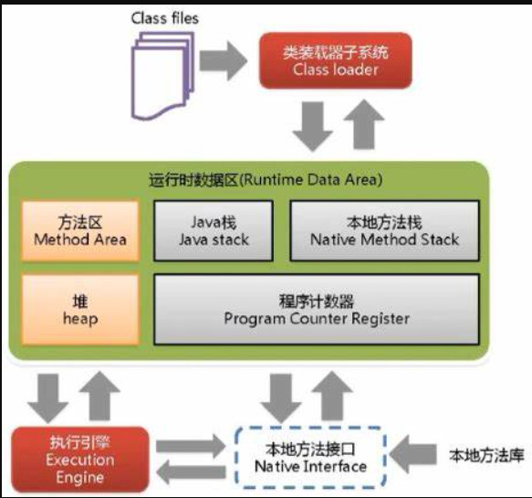

### java代码执行流程
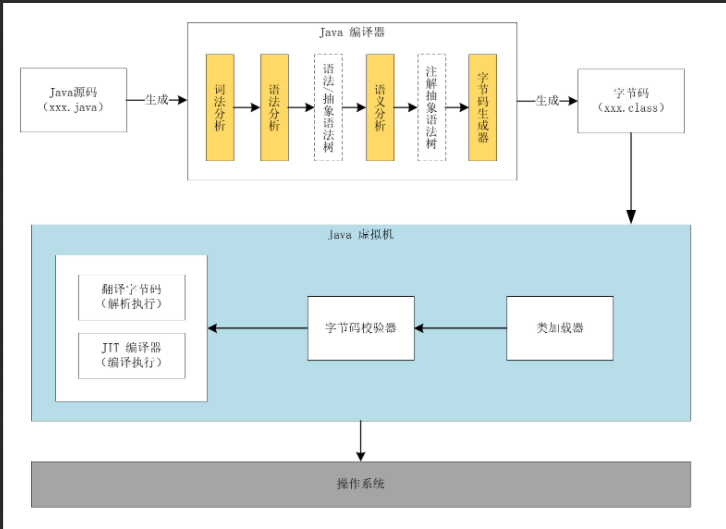

### jvm的架构模型
    Java编译器输入的指令流基本上是一种基于栈的指令集架构,另外一种指令集架构则是基于寄存器的指令集架构。
    具体来说:这两种架构之间的区别:
        ·基于栈式架构的特点
            >设计和实现更简单,适用于资源受限的系统;
            >避开了寄存器的分配难题:使用零地址指令方式分配。
            >指令流中的指令大部分是零地址指令,其执行过程依赖于操作栈。指令集更小,编译器容易实现。
            >不需要硬件支持,可移植性更好,更好实现跨平台
        ·基于寄存器架构的特点
            >典型的应用是x86的二进制指令集:比如传统的PC以及Android的Davlik虚拟机。
            >指令集架构则完全依赖硬件,可移植性差.
            >性能优秀和执行更高效;
            >花费更少的指令去完成一项操作。在大部分情况下,基于寄存器架构的指令集往往都以
            一地址指令、二地址指令和三地址指令为主,而基于栈式架构的指令集却是以零地址指令为主。
    由于跨平台性的设计，java的指令都是根据栈设计的。不同平台cpu架构不同。所以不能设计为基于寄存器的。
            
### jvm的生命周期
    虚拟机的启动：
        java虚拟机的启动是通过引导类加载器(bootstrap class loader)创建一个初始化类(initial class)
        来完成的，这个类是由虚拟机的具体实现指定的。
    虚拟机的执行：
        一个运行中的java虚拟机有着一个清晰的任务，即执行java程序
        程序开始执行时它才运行，程序结束时它就停止
        执行一个所谓的java程序的时候，真正在执行的是一个叫做java虚拟机的进程
    虚拟机的退出有如下的几种情况:
        程序正常执行结束。
        程序在执行过程中遇到了异常或错误而异常终止。
        由于操作系统出现错误而导致Java虚拟机进程终止。
        某线程调用Runtime类或System类的exit方法,或Runtime类的halt方法,并且Java安全管理器也允许这次exit或halt操作。
        除此之外, JNI ( Java Native Interface)规范描述了用JNIInvocation API来加载或卸载Java虚拟机时, Java虚拟机的退出情况。        

### jvm的发展历程
    classic VM, Exact VM, HotSpot VM, JRockit, J9, AZul VM, Liquid VM, TaobaoJVM, Graal VM...
    jvm以HotSpot VM为例学习
    
##  类加载(装载)子系统（class loader subsystem）的作用    
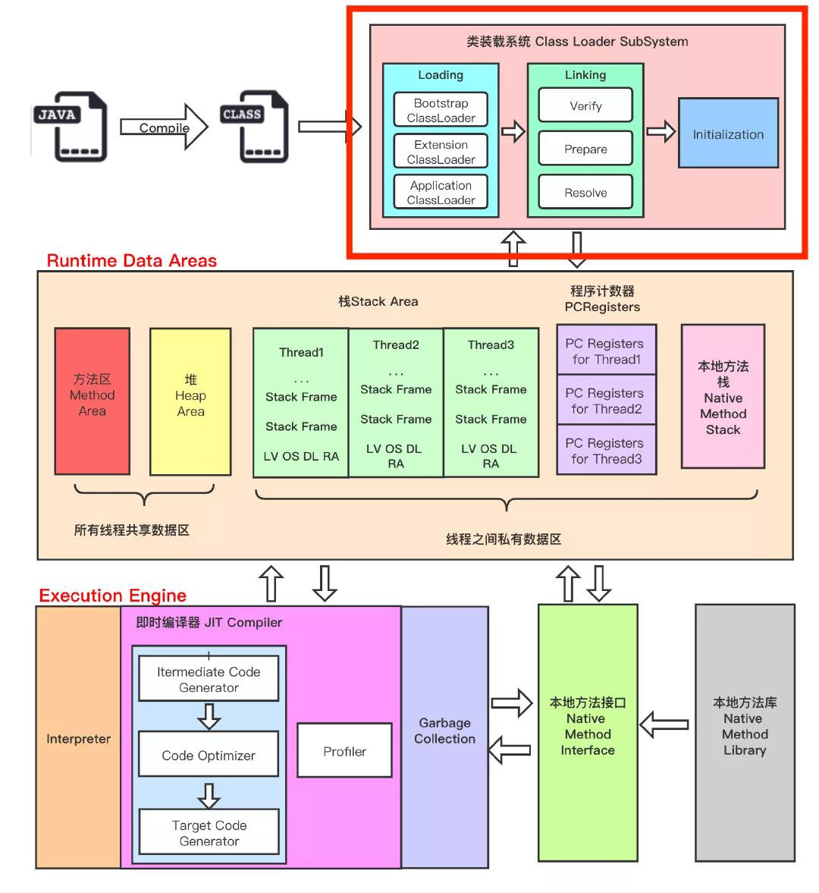
[类加载子系统](https://blog.csdn.net/WantFlyDaCheng/article/details/104453944)

    类加载子系统负责从文件系统或者网络中加载class文件，class文件在文件开头有特定的文件标识。
    ClassLoader只负责class文件的加载，至于它是否可以运行，则由Execution Engine决定。
    加载的类信息存放于一块称为方法区的内存空间。除了类的信息外，方法区中还会存放运行时常量池，
    可能还包含字符串字面量和数字常量（这部分常量信息是Class文件中常量池部分的内存映射）
    
    加载（loading）：
        1. 通过一个类的全限定名获取定义此类的二进制字节流
        2. 将这个字节流所代表的静态存储结构转化为方法区的运行时数据结构
        3. 在内存中生成一个代表这个类的java.lang.Class对象，作为方法区这个类的各种数据的访问入口
    
    链接（linking）：
        验证（Verify）：目的在于确保Class文件的字节流中包含信息符合当前虚拟机要求，
        保证被加载类的正确性，不会危害虚拟机自身安全主要包括四种验证，
        文件格式验证，元数据验证，字节码验证，符号引用验证
        
        准备（Prepare）：为类变量分配内存并且设置该类变量的默认初始值，即零值
        这里不包含用final修饰的static，因为final在编译的时候就会分配了，准备阶段会显示初始化
        这里不会为实例变量分配初始化，类变量会分配在方法区中，而实例变量是会随着对象一起分配到Java堆中
        
        解析（Resolve）：将常量池内的符号引用转换为直接（地址）引用的过程
        事实上，解析操作往往会伴随着JVM在执行完初始化之后再执行
        符号引用就是一组符号来描述所引用的目标。符号引用的字面量形式明确定义在Java虚拟机规范的Class文件格式中。
        直接引用就是直接指向目标的指针、相对偏移量或一个间接定位到目标的句柄.
        解析动作主要针对类或接口、字段、类方法、接口方法、方法类型等。
        对应常量池中的CONSTANT_Class_info、CONSTANT_Fieldref_info、CONSTANT_Methodref_info等
        
    初始化（initalization）:
        初始化阶段就是执行类构造器方法<clinit>()的过程
        此方法不需要定义，是javac编译器自动收集类中的所有类变量的赋值动作和静态代码块中的语句合并而来
        构造器方法中指令按语句在源文件中出现的顺序执行
        <clinit>()不同于类的构造器（构造器是虚拟机视角下的<init>()）
        若该类具有父类，JVM会保证子类的<clinit>()执行前，父类的<clinit>()已经执行完毕
        虚拟机必须保证一个类的<clinit>()方法在多线程下被同步加锁
        
### 类加载器的分类
    jvm支持两种类型的类加载器，分别是引导类加载器（bootstrap classLoader）
    和自定义类加载器（User-Defined classLoder）
    从概念上来讲，自定义类加载器一般指的是程序中由开发人员自定义的一类类加载器，
    但是java虚拟机规范却没有这么定义，而是将所有派生于抽象类ClassLoader的类加载器都
    划分为自定义类加载器
    
    虚拟机自带的加载器：
        启动类加载器（引导类加载器）：
            这个类加载使用c/c++语言实现的，嵌套在jvm的内部
            它用来加载Java的核心库（JAVA_HOME/jre/lib/rt.jar，resources.jar，sun.boot.class.path下的内容），
            用于提供jvm自身需要的类
            并不继承自java.lang.ClassLoader，没有父加载类
            加载 扩展类加载器和应用程序类加载器，并指定为他们的父类加载器
            处于安全考虑，bootstrap启动类加载器只加载包名为java,javax,sun等开头的类
        
        扩展类加载器：
            java语言编写，派生于ClassLoader类，父类加载器为启动类加载器
            从java.ext.dirs系统属性所指定的目录中加载类库，或从jdk的安装目录的jre/lib/ext子目录下加载类库。
            如果用户创建的jar放在此目录下，也会自动由扩展类加载器加载
    
        应用程序类加载器（系统类加载器）：
            java语言编写，派生于ClassLoader类，父类加载器为扩展类加载器
            它负责加载环境变量classpath或系统属性java.class.path指定路径下的类库。
            该类加载器是程序中默认的类加载器，一般来说，java应用的类都是由它完成加载的
            通过ClassLoader.getSystemClassLoader()方法可以获取到该类加载器
            
    自定义类加载器：
        自定义类加载器可以 隔离加载类，修改类加载的方式，扩展加载源，防止源码泄露
        自定义方式之一： 继承java.lang.ClassLoader类并把自定义的类加载逻辑写在findClass()方法中
    
### 双亲委派机制
    1)如果一个类加载器收到了类加载请求,它并不会自己先去加载,而是把这个请求委托给父类的加载器去执行;
    2)如果父类加载器还存在其父类加,载器,则进一步向上委托,依次递归请求最终将到达顶层的启动类加载器;
    3)如果父类加载器可以完成类加载任务,就成功返回,倘若父类加载器无法完成此加载任务,
    子加载器才会尝试自己去加载,这就是双亲委派模式。
    如，自己定义一个 java.lang.String 类，当要使用该类时，先是AppClassLoader收到了类加载请求然后
    向上委托给ExtensionClassLoader再向上委托给BootsrapClassLoader，当BootstrapClassLoader可以加载此类，
    就成功返回了（找到了对应的类），此时使用到的就是java自带源库的String类，
    但自己定义一个xxx.yyy.ZZ类，显然最后由AppClassLoader加载对应的类
    
    双亲委派机制作用：避免类的重复加载，保护程序安全（沙箱安全机制），防止核心api被随意篡改
    
    
### 类的主动使用与被动使用
    判断两个class对象是否为同一个类的必要条件： 全限定类名必须一致，加载这个类的类加载器必须相同。
    JVM必须知道一个类型是由启动加载器加载的还是由用户类加载器加载的。
    如果一个类型是由用户类加载器加载的,那么JVM会将这个类加载器的一个引用作为类型信息的一部分保存在方法区中。
    当解析一个类型到另一个类型的引用的时候, JVM需要保证这两个类型的类加载器是相同的。
    
    主动使用,分为七种情况:
        >创建类的实例
        >访问某个类或接口的静态变量,或者对该静态变量赋值
        >调用类的静态方法
        >反射(比如: Class .forName ("com.atguigu.Test") )
        >初始化一个类的子类
        >Java虚拟机启动时被标明为启动类的类
        >JDK 7开始提供的动态语言支持:
        java.lang.invoke.MethodHandle实例的解析结果REF-getStatic,
        REF_putstatic. REF invokestatic句柄对应的类没有初始化,则初始化
        
        除了以上七种情况,其他使用Java类的方式都被看作是对类的被动使用,都不会导致类的初始化。    

## 运行时数据区（running data area）
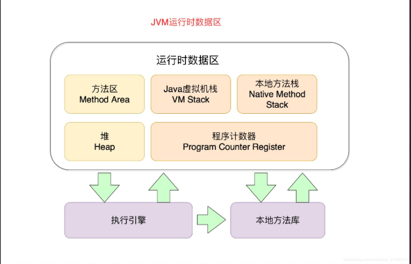
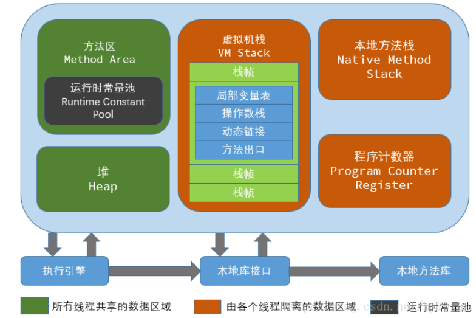

    内存是非常重要的系统资源，是硬盘和cpu的中间仓库及桥梁，承载着操作系统和应用程序的实时运行。
    jvm内存布局规定了java在运行过程中内存申请，分配，管理的策略，保证了jvm的高效稳定运行。
    不同的jvm对于内存的划分方式和管理机制存在着部分差异。
    
    java虚拟机定义了若干种程序运行期间会使用到的运行时数据区，其中有一些会随着虚拟机启动而创建，
    随着虚拟机退出而销毁，另外一些则是与线程一一对应的，这些与线程对应的数据区域会随着线程开始和结束而创建和销毁。
    
### jvm中的线程
    线程是一个程序里的运行单元，jvm允许一个应用有多个线程并行的执行
    在HotSpot VM里，每个线程都与操作系统的本地线程直接映射。
    当一个java线程准备好执行以后，此时一个操作系统的本地线程也同时创建。
    java线程执行终止后，本地线程也会回收。
    操作系统负责所有线程的安排调度到任何一个可用的cpu上，一旦本地线程初始化成功，
    它就会调用java线程中的run()方法    
    
    守护线程和普通线程：
        在后台有许多线程在运行，这些后台线程不包括调用public static void main (String[] args)的main线程以及
        所有这个main线程自己创建的线程。这些主要的后台系统线程在Hotspot JV里主要是以下几个:
            >虚拟机线程: 这种线程的操作是需要JVM达到安全点才会出现。
            这些操作必须在不同的线程中发生的原因是他们都需要JVM达到安全点,这样堆才不会变化。
            这种线程的执行类型包括"stop-the-world"的垃圾收集,线程栈收集,线程挂起以及偏向锁撤销。
      
            >周期任务线程:这种线程是时间周期事件的体现(比如中断) ,他们一般用于周期性操作的调度执行
            
            >GC线程:这种线程对在JVM里不同种类的垃圾收集行为提供了支持。
            
            >编译线程:这种线程在运行时会将字节码编译成到本地代码。
            
            >信号调度线程:这种线程接收值号并发送给JVM,在它内部通过调用适当的方法进行处理。
    
### 程序计数器（pc寄存器, program counter register）
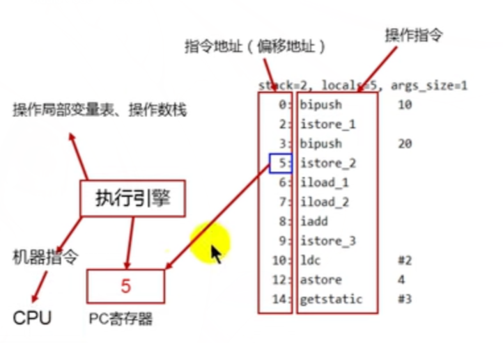

    jvm中的程序寄存器中，Register的命名源于cpu的寄存器，寄存器存储指令相关的现场信息。
    cpu只有把数据装载到寄存器才能够运行。并非广义所指的物理寄存器，或许将其翻译为pc计数器会更好。
    也称为程序的钩子，并且也不容易引起一些不必要的误会，jvm中的pc寄存器是对物理pc寄存器的一种抽象模拟。
    它是一块很小的内存空间，几乎可以忽略不计，也是运行速度最快的存储区域。
    在jvm规范中，每个线程都有它自己的程序计数器，是线程私有的，生命周期与线程的生命周期保持一致。
    任何时间一个线程都只有一个方法在执行，也就是所谓的当前方法。程序计数器会存储当前线程正在执行的java方法的jvm指令地址，
    或者，如果是在执行native方法，则是未指定值(undefined)。
    它是程序控制流的指示器，分支，循环，异常处理，线程恢复等基本功能都需要依赖于这个计数器来完成。
    字节码解释器工作时就是通过改变这个计数器的值来选取下一条需要执行的字节码指令。
    它是唯一一个在java虚拟机规范中没有规定任何OutOfMemoryError(内存用完错误)情况的区域。 
       
    作用： pc寄存器用来存储指向下一条指令的地址，由执行引擎读取下一条指令。

    问：  为什么使用pc寄存器记录当前线程的执行地址呢？
    解：  因为cpu需要不停的切换各个线程，这时候切换回来就需要知道从哪开始继续执行。
    jvm的字节码解释器就需要通过改变pc寄存器的值来明确下一条应该执行什么样的字节码指令。
    
    问：  pc寄存器为什么会被设定为线程私有的？
    解：  为了能够准确记录各个线程正在执行的当前字节码指令地址，最好的办法自然就是每个线程都分配一个pc寄存器
    
    cpu时间片： cpu时间片即cpu分配给各个程序的时间，每个线程被分配一个时间段，称作它的时间片
    在宏观上，我们可以同时打开多个应用程序，每个程序并行不悖，同时运行。
    但微观上，由于只有一个cpu，一次只能处理程序要求的一部分， 为了处理公平，一种方法就是引入时间片，每个程序轮流执行。
    
## 虚拟机栈（Java virtual machine stack）
     栈是运行时的单位，而堆是存储的单位。
     栈解决程序的运行问题。即程序如何执行，或者说如何处理数据，堆解决的是数据存储的问题，即数据怎么放，放在哪里。
    
     Java虚拟机栈早期也叫java栈，每个线程在创建时都会创建一个虚拟机栈，虚拟机栈是线程私有的，生命周期与线程一致
     其内存保存一个个的栈帧（Stack Frame），对应着一次次java方法的调用。 
     
     作用： 主管java程序的运行，它保存方法的局部变量，部分结果，并参与方法的调用和返回。
     
     栈是一种快速有效的分配存储方式，访问速度仅次于程序计数器（pc寄存器）。
     jvm直接对虚拟机栈的操作只有两种：每个方法执行，伴随着进栈（入栈，压栈） 和 执行结束后的出栈工作。
     对于栈来说，不存在垃圾回收问题
     
     栈中可能出现的异常:
        Java虚拟机规范允许Java栈的大小是动态的或者是固定不变的。
        >如果采用固定大小的Java虚拟机栈,那每一个线程的Java虚拟机容量可以在线程创建的时候独立选定。
        如果线程请求分配的栈容量超过Java虚拟机栈允许的最大容量, Java虚拟机将会抛出一个StackoverflowError异常。
       
        >如果Java虚拟机栈可以动态扩展,并且在尝试扩展的时候无法申请到足够的内存,
        或者在创建新的线程时没有足够的内存去创建对应的虚拟机栈,那Java虚拟机将会抛出一个outofMemoryError异常。
        
     设置栈内存大小：可以使用参数 -Xss 选项来设置线程的最大栈空间，栈的大小直接决定了函数调用的最大可达深度。
                
     栈的存储单位：
        每个线程都有自己的栈，栈中的数据都是以栈帧的格式存在。
        在这个线程上正在执行的每个方法都各自对应一个栈帧。
        栈帧是一个内存区域，是一个数据集，维系着方法执行过程中的各种数据信息。
        
        JVM直接对Java栈的操作只有两个,就是对栈帧的压栈和出栈,遵循“先进后出” /“后进先出”原则。
        在一条活动线程中,一个时间点上,只会有一个活动的栈帧。即只有当前正在执行的方法的栈帧(栈顶栈帧)是有效的,
        这个栈帧被称为当前栈帧(Current Frame) ,与当前栈帧相对应的方法就是当前方法(currentMethod) ,
        定义这个方法的类就是当前类(Current Class)。
        执行引擎运行的所有字节码指令只针对当前栈帧进行操作。如果在该方法中调用了其他方法,
        对应的新的栈帧会被创建出来,放在栈的顶端,成为新的当前栈帧。
        
     栈运行原理：  
        不同线程中所包含的栈帧是不允许存在相互引用的,即不可能在一个栈帧之中引用另外一个线程的栈帧。
        如果当前方法调用了其他方法,方法返回之际,当前栈帧会传回此方法的执行结果给前一个栈帧,接着,
        虚拟机会丢弃当前栈帧,使得前一个栈帧重新成为当前栈帧。Java方法有两种返回函数的方式,
        一种是正常的函数返回,使用return指令;另外一种是抛出异常,不管使用哪种方式,都会导致栈帧被弹出。
        
     栈帧的内部结构：
        每个栈帧中存储着：
            局部变量表（Local Variables）
            操作数栈（Operand Stack）（或表达式栈）
            动态链接（Dynamic Linking）（或指向运行时常量池的方法引用）
            方法返回地址（Return Address）（或方法正常退出或者异常退出的定义）
            以及一些附加信息
            
        局部变量表：
            局部变量表也被称为局部变量数组或本地变量表。
            定义为一个数字数组，主要用于存储方法参数和定义在方法体内的局部变量，
            这些数据的类型包括 各类基本数据类型和 对象引用（reference），以及returnAddress类型。
            由于局部变量表是建立在线程的栈上，是线程的私有数据，因此不存在数据安全问题。
            局部变量表所需的容量大小是在编译期间确定下来的，
            并保存在方法的Code属性的maximum local variables数据项中。
            在方法运行期间是不会改变局部变量表的大小的。
            
        方法嵌套调用的次数由栈的大小决定。一般来说,栈越大,方法嵌套调用次数越多。
        对一个函数而言,它的参数和局部变量越多,使得局部变量表膨胀,它的栈帧就越大,
        以满足方法调用所需传递的信息增大的需求。进而函数调用就会占用更多的栈空间,
        导致其嵌套调用次数就会减少。局部变量表中的变量只在当前方法调用中有效。
        在方法执行时,虚拟机通过使用局部变量表完成参数值到参数变量列表的传递过程。
        当方法调用结束后,随着方法栈帧的销毁,局部变量表也会随之销毁。
        
        Slot的理解：
            局部变量表，最基本的存储单元是Slot（变量槽）。
            参数值的存放总是在局部变量数组的indexOf开始，到数组长度-1的索引结束。
            局部变量表中存放编译期间可知的各种基本数据类型（8种），引用类型（reference），
            returnAddress类型的变量。
            在局部变量表里，32位以内的类型只占用一个Slot（包括returnAddress类型），
            64位的类型（long和double）占用两个slot。
            byte，short，char在存储前被转换为了int，boolean也被转换为int（false为0，true为1），
            以及float都是占一个slot。 long和double则占据两个slot。
            
            JVM会为局部变量表中的每一个s1ot都分配一个访问素引,通过这个索引即可成功访问到局部变量表中指定的局部变量值。
            当一个实例方法被调用的时候,它的方法参数和方法体内部定义的局部变量将会按照顺序被复制到局部变量中的每一个slot上。
            如果需要访问局部变量表中一个64bit的局部变量值（占两个槽）时,只需要使用前一个索引即可。(比如：访问1ong或double类型变量)。
            如果当前栈帧是由构造方法或者实例方法创建的，那么该对象引用的 this 将会存放在indkx为0的slot处,
            其余的参数按照参数表顺序继续排列.
            
            slot的重复利用：
                栈帧的局部变量表中的槽位（slot）可以被重用，如果一个局部变量过了其作用域，
                那么在其作用域之后申明的局部变量就很有可能会复用过期的局部变量的槽位，从而达到节省资源的目的。
                
        在栈帧中,与性能调优关系最为密切的部分就是局部变量表。在方法执行时,虚拟机使用局部变量表完成方法的传递。
        局部变量表中的变量也是重要的垃圾回收根节点,只要被局部变量表中直接或间接引用的对象都不会被回收。
        
        操作数栈（Operand Stack）：
            每个独立运行的栈帧中除了包含局部变量表之外，还包含一个后进先出的操作数栈，也以称之为表达式栈。
            操作数栈，在方法执行过程中，根据字节码指令，往栈中写入数据或提取数据，即入栈和出栈。
            某些字节码指令将值压入操作数栈，其余的字节码指令将操作数取出栈，使用它们后再把它们的结果压入栈中。
            
            操作数主要用于保存计算过程的中间结果，同时作为计算过程中变量临时的存储空间。
            操作数栈就是jvm执行引擎的一个工作区，当一个方法刚开始执行的时候，一个新的栈帧也会随之被创建出来。
            这个方法的操作数是空的。
            每一个操作数栈都会拥有一个明确的栈深度用于存储数值，其所需的最大深度在编译期就定义好了，
            保存在方法的Code属性中，为max_stack的值。
            栈中任何一个元素都是可以为任意的java数据类型。
            32位的类型占用一个栈单位深度，64位的类型占用两个栈单位深度。
            操作数栈并非采用访问索引的方式来进行数据访问的，而是只能通过标准的入栈和出栈操作来完成一次数据访问的。
            如果被调用的方法带有返回值的话，其返回值将会被压入当前栈帧的操作数栈中，并更新pc寄存器中下一条需要执行的字节码指令。
            操作数栈中元素的数据类型必须与字节码指令的序列严格匹配，这在编译器编译期间进行验证，同时在类加载过程中的类校验阶段的
            数据流分析阶段再次验证。
            另外，java虚拟机的解释引擎是基于栈的执行引擎，其中的栈指的就是操作数栈。
            
            栈顶缓存（top of stack cashing）技术：
                由于jvm基于栈式架构，必然有很多的入栈和出栈指令，这会影响执行速度，
                使用栈顶缓存技术将栈顶元素全部缓存在物理cpu的寄存器中以此降低对内存读/写次数，提升执行引擎的执行效率。
        
        动态链接（Dynamic Linking）：
            每一个栈帧内部都包含一个指向运行时常量池中该栈帧所属方法的引用。包含这个引用的目的就是为了支持当前方法的
            代码能够实现动态链接，如 invokedynamic等
            
            在java源文件被编译到字节码文件中时，所有的变量和方法引用操作 为符号引用(Symbolic Reference)
            保存在class文件的常量池里。如，描述一个方法调用了另一个其他方法时，就是通过常量池中指向方法的符号引用来表示的，
            那么动态链接的作用就是为了将这些符号引用转换为调用方法的直接引用。
            
            常量池的作用，就是为了提供一些符号和常量，便于指令的识别。
        
        方法的调用：
            在jvm中，将符号引用转换为调用方法的直接引用方法与方法的绑定机制相关。
            静态链接：
                当一个字节码文件被装载到jvm内部时，如果被调用的目标方法在编译期间可知，
                且运行期间保持不变时，这种情况下将调用方法的符号引用 转换为直接引用的过程称为静态链接。
                与之对应的是早期绑定。
            动态链接：
                如果被调用的方法在编译期间无法被确定下来，也就是说，
                只能够在程序运行期间将调用方法的符号引用转换为直接引用，由于这种引用转换过程具备动态性，
                因此也被称为动态链接。 与之对应的是晚期绑定。   
                    
            虚方法与非虚方法（本质区别就是是否有多态性）：
                如果方法在编译期间就确定了具体的调用版本，这个版本在运行时是不可变的，这样的方法称为非虚方法。
                像 静态方法，私有方法，final方法，实例构造器，父类方法都是非虚方法。
                其余方法称为虚方法。
            
            虚拟机中提供了以下几条方法调用指令:
                普通调用指令:
                    1. invokestatic:    调用静态方法, 解析阶段确定唯一方法版本。
                    2. invokespecial:   调用<init>方法、私有及显式父类方法,解析阶段确定唯一方法版本。
                    3. invokevirtual:   调用所有虚方法。
                    4. invokeinterface: 调用接口方法。
                动态调用指令:
                    5. invokedynamic:   动态解析出需要调用的方法,然后执行。
                    前四条指令固化在虚拟机内部,方法的调用执行不可人为干预,
                    而invokedynamic指令则支持由用户确定方法版本（使用lambda表达式确定方法版本）。
                    其中invokestatic指令和invokespecial指令调用的方法称为非虚方法,
                    其余的(fina1修饰的除外)称为虚方法。
                    
            在面向对象的编程中,会很频繁的使用到动态分派,如果在每次动态分派的过程中都要
            重新在类的方法元数据中搜索合适的目标的话就可能影响到执行效率，如方法重写的本质。
            因此,为了提高性能, JVM采用在类的方法区建立一个虚方法表(virtual method table)
            (非虚方法不会出现在表中)来实现。使用索引表来代替查找。
            每个类中都有一个虚方法表,表中存放着各个方法的实际入口。
            
            虚方法表会在类加载的链接阶段被创建并开始初始化,类的变量初始值准备完成之后, JVM会把该类的方法表也初始化完毕。
            
            方法返回地址（return address）：
                存放调用该方法后的pc寄存器的值，即 调用方法完后的调用者pc寄存器的下一个值。
                一个方法的结束，有两个方式：正常执行完成，和出现未处理异常非正常退出。但无论通过哪种方式退出，
                在方法退出后都返回到该方法被调用的位置。正常退出时，调用者 的pc计数器的值变为方法返回地址，即
                调用该方法的指令的下一条指令的地址。而通过异常退出的，返回地址是要通过异常表来确定的，
                栈帧中一般不会保存这部分信息。
                本质上，方法的退出就是当前栈帧出栈的过程。此时，需要恢复上层方法的局部变量表，操作数栈，
                将返回值压入调用者栈帧的操作数栈，设置pc寄存器值等，让调用者方法继续执行下去。
                正常完成出口和异常完成出口的区别在于，通过异常完成出口退出的不会给它的上层调用者产生任何的返回值。
            
            当一个方法开始执行后,只有两种方式可以退出这个方法:
                1、执行引擎遇到任意一个方法返回的字节码指令(return) ,会有返回值传递给上层的方法调用者,简称正常完成出口:
                    >一个方法在正常调用完成之后究竟需要使用哪一个返回指令还需要根据方法返回值的实际数据类型而定。
                    >在字节码指令中,返回指令包含ireturn (当返回值是boolean, byte, char.short和int类型时使用)、
                    1return, freturn, dreturn以及areturn,另外还有一个return指令供声明为void的方法、
                    实例初始化方法、类和接口的初始化方法使用。    
                
                2、在方法执行的过程中遇到了异常(Exception) ,并且这个异常没有在方法内进行处理,
                也就是只要在本方法的异常表中没有搜索到匹配的异常处理器,就会导致方法退出。 简称异常完成出口。
                方法执行过程中抛出异常时的异常处理,存储在一个异常处理表,方便在发生异常的时候找到处理异常的代码。
## 堆（heap）
    一个jvm实例只存在一个堆内存，堆也是Java内存管理的核心区域。
    java堆区在jvm启动的时候就被创建，其空间大小也就确定了。是jvm管理的最大一块内存空间。
    堆内存的大小是可以调节的。 
    在java虚拟机规范中规定，堆可以处于物理上不连续的内存空间中，但在逻辑上它应该被视为连续的。
    所有的线程共享java堆，在这里还可以划分线程私有的缓冲区（Thread Local Allocation Buffer）。

    java虚拟机规范中对Java堆的描述是： 所有（几乎所有）的对象实例以及数组都应该在运行时分配在堆上。
    数组和对象可能永远不会存储在栈上，因为栈帧中保存引用，这个引用指向对象或数组堆中的位置。
    在方法结束后，堆中的对象不会马上被移除，仅仅在垃圾收集的时间才会被移除。
    堆，是GC（Garbage Collection,垃圾收集器）执行垃圾回收的重点区域。
    
    现代垃圾收集器大部分都基于分代收集理论设计，堆空间细分为：
        java7及以前堆内存逻辑上分为三部分：新生区 + 养老区 + 永久区
            >Young Generation Space 新生区 young/new
                > Eden区 和 Survivor区
            > Tenure Generation Space 养老区  old/tenure            
            > Permanent Space 永久区   perm
        java8及以后堆内存逻辑上分为三部分：新生区 + 养老区 + 元空间
            >Young Generation Space 新生区 young/new
                > Eden区 和 Survivor区
            > Tenure Generation Space 养老区  old/tenure  
            > Meta Space 元空间    meta
        
        java堆空间用于存储java的对象实例，那么堆的大小在jvm启动时就已经决定了，可以通过选项
        -Xms 和 -Xmx 设置堆大小。
            -Xms 用于表示堆区的起始内存，等价于-XX:InitialHeapSize
            -Xmx 用于表示堆区的最大内存，等价于-XX:MaxHeapSize
        一旦堆区中的内存大小超过“-Xmx”所指定的最大内存时，将会抛出OutOfMemoryError异常。
        通常会将-Xms和-Xmx两个参数配置相同的值，
        其目的是为了能够在java垃圾回收机制清理完堆区后不需要重新分隔堆区的大小，从而提高性能。
        
        默认情况下，初始内存大小为 物理电脑内存 / 64， 最大内存大小为 物理电脑内存大小/4
            
        存储在jvm中的java对象可以被划分为两类：       
            一类是生命周期较短的瞬时对象，这类对象的创建和消亡都非常迅速。
            另一类对象的生命周期却非常长，在某些极端的情况下还能够与jvm的生命周期保持一致。
            java堆区进一步细分的话，可以划分为 年轻代（YouangGen）和老年代（OldGen）。
            其中年轻代又可以划分为Eden空间，Survivor0空间Survivor1空间（有时也叫from区和to区）
            
            配置新生代与老年代在堆结构的占比：
                默认-XX:NewRatio=2， 表示新生代占1， 老年代占2，新生代占整个堆的1/3.
                可以修改 -XX:NewRatio=4, 表示新生代占1，老年代占4，新生代占整个堆的1/5。
                默认新生代中的 Eden与Survivor0，Survivor1的比例为 8:1:1。
                但是实际因为有自适应(可以通过-XX:-UseAdaptiveSizePolicy关闭)，比例为6:1:1，
                该比例可以通过-XX:SurvivorRatio修改。
                
            几乎所有的Java对象都是在Eden区被new出来的。
            绝大部分的java对象的销毁都在新生代进行，有研究表明，新生代中80%的对象都是 朝生夕逝。
            可以使用选项 -Xmn 设置新生代最大的内存大小，一般不设置。
            
             为新的对象分配内存是一件严肃和复杂的任务，jvm的设计者们不仅需要考虑内存如何分配，在那里分配等问题，
             并且由于内存分配算法与内存回收算法密切相关，所以还需要考虑GC执行完内存回收后是否会在内存空间中产生内存碎片。
             
             1. new的对象先放在伊甸园区，此区有大小限制。
             2. 当伊甸区的空间填满时，程序又需要创建对象，jvm的垃圾回收器将对伊甸区进行垃圾回收（Minor GC），
             将伊甸区中不再被引用的对象进行销毁，在加载新的对象放到伊甸区。
             3. 然后将伊甸区中的剩余对象移动到幸存者0区。
             4. 如果再次触发垃圾回收，此时上次幸存下来的放在幸存者0区的，如果没有回收，就会放到幸存者1区。
             5. 如果再次经历垃圾回收，此时会重新放回幸存者0区，接着再去幸存者1区。
             6. 默认经历了 16次垃圾回收后，可以到养老区了，当然经历次数可以设置：
                -XX:MaxTenuringThreshold=<number>进行设置。   
                
             例如： 小孩成长到 16岁就进入了 老年代，每一岁都要经历垃圾过滤器（垃圾回收器）的过滤，
             没有通过的就夭折。大部分孩子在Eden区刚出生没有多久就被垃圾回收了，原因就是它们没用了。
             
             针对幸存者survivor0区和survivor1区，复制之后又交换，谁空谁是to。
             关于垃圾回收： 频繁在新生区收集，很少在养老区收集，几乎不在永久区收集。
             
        Minor GC， Major GC 与 Full GC：
            jvm在进行gc时，并非每次都对新生代，老年代和方法区一起回收的，大部分时候回收的都是指新生代。
            针对HotSpotVM的实现，它里面的gc按照回收区域又分为两种类型：
            一种为部分收集（Partial GC）， 一种是整堆收集（Full GC）
            部分收集：   不是完整收集整个java堆的垃圾收集，其中又可分为：
                新生代收集（Minor GC/Young GC）：只是整个新生代的垃圾收集。
                老年代收集（Major GC/Old GC）： 只是整个老年代的垃圾收集。
                    目前，只有CMS GC会有单独收集老年代的行为。
                混合收集（Mixed GC）： 收集整个新生代以及部分老年代的垃圾收集。
                    目前，只有G1 GC会有这种行为。
            整堆收集（Full GC）： 收集整个java堆和方法区的垃圾收集。                           
            
            年轻代GC（Minor GC）触发机制： 
                当年轻代空间不足时，就会触发minor gc， 这里的年轻代满指的是
                Eden代满，Survivor满不会触发GC，每次minor gc会清理年轻代的内存。
                因为java对象大多都具备朝生夕逝的特性，所以minor GC非常频繁，一般回收速度也比较快。
                Minor GC会引发STW， 暂停其他用户的线程，等垃圾回收结束，用户线程才恢复运行。
            
            老年代GC（Major GC/Full GC）触发机制： 
                指发生在老年代的GC，对象从老年代消失时，可以说Major GC或Full GC发生了。
                出现了Major GC，经常会伴随至少一次的Minor GC（并非绝对的，在Parallel Scavenge收集器的收集策略里
                就有直接进行Major GC的策略选择过程）。
                也就是在老年代空间不足时，会先尝试触发Minor GC ,如果之后空间还不足，则触发Major GC
                Major GC的速度一般会比Minor GC慢10倍以上，STW的时间更长。
                如果Major GC后， 内存还不足，就会报oom了。
                
            Full GC触发机制： 
                调用System.gc()时，系统建议执行Full GC，但是不必然执行。
                老年代空间不足时。方法区空间不足时。通过Minor GC后进入老年代的平均大小大于老年代的可用内存。
                由Eden区，Survivor space0（From Space）区向Survivor space1（To Space）区复制时，
                对象大小大于To Space可用内存，则把该对象转存到老年代，且老年代的可用内存小于该对象的大小。
                尽量避免Full GC来减少暂停时间。    
        
        堆空间分代思想：
            为什么需要把java堆分代？
            经研究，不同对象的生命周期不同，70%到99%的对象是临时对象。分代的唯一理由是优化GC性能。
            
         内存分配策略（或对象提升（promotion）规则）：
            如果对象在Eden出生并经过第一次Minor GC后仍然存活，并且能被Survivor容纳的话，将被移动到
            Survivor空间中，并将对象年龄增加1岁，对象在Survivor区中每熬过一次Minor GC，年龄就会加1，
            当年龄增加到一定岁数（默认为15岁阈值，16岁就到老年代区了）时，就会被晋升（promotion）到老年代中。
            
            针对不同年龄段的对象分配原则如下所示：            
                优先分配到Eden， 大对象直接分配到老年代，长期存活的对象分配到老年代，
                如果Survivor区中相同年龄的所有对象大小的总和大于Survivor空间的一半，年龄大于该年龄的对象可以直接进入老年代，
                无须等到MaxTenuringThreshold中要求的年龄。
                空间分配担保： --XX:HnalePromotionFailure=true
                
        为对象分配内存： TLAB（Thread Local Allocation Buffer）
            堆区是线程共享区域，任何线程都可以访问到堆区中的共享数据。
            由于对象实例的创建在jvm中非常频繁，因此在并发环境下从堆区中划分内存空间是线程不安全的。
            为了避免多个线程操作同一个地址，需要使用加锁等机制，进而影响分配速度。
        
            TLAB从内存模型而不是垃圾收集的角度考虑，堆Eden区域继续进行划分，jvm为每个线程分配了一个
            私有的缓存区域，它包含在Eden空间中。
            多线程同时分配内存时，使用TLAB可以避免一系列的非线程安全问题。
            同时还能够提升内存分配的吞吐量，因此可以将这种内存分配方式称为 快速分配策略。
            通过 -XX:UserTLAB 设置是否开启了TLAB空间。默认情况，TLAB仅占整个Eden空间的1%，
            但jvm确实是将TLAB作为内存分配的首选。通过 -XX:TLABWasteTargetPercent 设置TLAB的占比。
            一旦对象在TLAB空间分配内存失败时，jvm就会尝试通过使用加锁机制确保数据操作的原子性，
            从而直接在Eden空间中分配内存。
        
        堆空间的参数设置：                
            -XX:+PrintFlagsInitial 查看所有的参数的默认初始值
            -XX:+PrintFlagFinal 查看所有的参数的最终值
            -Xms  初始堆空间的内存大小
            -Xmx   最大堆空间内存
            -Xmn    设置新生代的大小
            -XX:NewRatio    配置新生代与老年代在堆结构的占比
            -XX:SurvivorRatio   设置新生代中Eden和S0和S1空间的占比
            -XX:MaxTenuringThreshold    设置新生代垃圾的最大年龄
            -XX:+PrintGCDetials     输出详细的GC处理日志
            -XX:+PrintGC    输出简要GC信息   
            -verbose:gc     输出简要GC信息
            -XX:HandlePromotionFailure  是否设置空间分配担保
    
    堆是分配对象存储的唯一选择吗？
        在Java虚拟机中,对象是在Java堆中分配内存的,这是一个普遍的常识。
        但是,有一种特殊情况,那就是如果经过逃逸分析(Escape Analysis)后发现,
        一个对象并没有逃逸出方法的话,那么就可能被优化成栈上分配。
        这样就无需在堆上分配内存,也无须进行垃圾回收了。这也是最常见的堆外存储技术.
        这是一种可以有效减少java程序中同步负载和内存堆分配压力的跨函数全局数据流分析算法。
        通过逃逸分析, Java Hotspot编译器能够分析出一个新的对象的引用的使用范围
        从而决定是否要将这个对象分配到堆上。 逃逸分析在jdk7就默认开启了。  
        逃逸分析的基本行为就是分析对象动态作用域:
            >当一个对象在方法中被定义后,对象只在方法内部使用,则认为没有发生逃逸。
            >当一个对象在方法中被定义后,它被外部方法所引用,则认为发生逃逸。
            例如作为调用参数传递到其他地方中。  
    代码优化：
        一. 栈上分配。 将堆分配转化为栈分配，如果一个对象在子程序中被分配，
        要使指向该对象的指针永远不会逃逸，对象可能是栈分配的候选，而不是堆分配。
        二. 同步省略。 如果一个对象被发现只能从一个线程被访问到，
        那么对于这个对象的操作可以不考虑同步。
        三. 分离对象或标量替换。 有的对象可能不需要作为一个连续的内存结构存在也可以被访问到，
        那么对象部分（或全部）可以不存储在内存，而是存储在cpu寄存器中。

## 方法区（method area）
    Person  person = new Person();
    方法区    虚拟栈     堆
    
    jvm规范中有说明，尽管所有的方法区在逻辑上属于堆的一部分，但一些简单的实现可能不会选择去进行垃圾回收或进行压缩。
    但对于HotSpot vm而言，方法区还有一个别名叫作Non-Heap（非堆），目的就是要和堆分开。
    所以，方法区看作是一块独立于java堆的内存空间。        
    
    方法区与java堆一样，是各个线程共享的内存区域。方法区在jvm启动时候被创建，并且它的实际的物理内存空间中和java堆区
    一样都可以不连续。
    方法区的大小，跟堆空间一样，可以选择固定大小或可扩展。
    方法区的大小决定了系统可以保存多少个类，如果系统定义了太多的类，导致方法区溢出，jvm同样也会抛出oom异常。
    关闭jvm就会释放这个区域的内存。
                
    在jdk7之前，习惯上把方法区（概念上称方法区）称为 永久代（实现方式）。 jdk8开始使用元空间取代永久代。
    本质上，方法区和永久区并并不等价。仅是对HotSpot VM而言的。
    对如何实现方法区，不做统一的要求，例如，BEA JRockit/IBM J9 中不存在永久代的概念。
    现在来看，当年使用永久代，不是好的idea，导致java程序更容易oom。
    
    而到了jdk8，终于完全废弃了永久代的概念，改用与JRockit，j9一样在本地内存中实现的元空间来代替。
    元空间的本质和永久代类似，都是jvm规范中方法区的实现，不过元空间与永久代最大的区别在于：
    元空间不在虚拟机设置的内存中，而是使用本地内存。
    永久代，元空间二者并不只是名字变了，内部结构也调整了。
    根据jvm规定，如果方法区无法满足新的内存分配需求时，将抛出oom异常。
    
    方法区的大小不必是固定的，jvm可以根据应用的需要动态调整，jdk8及以后，元数据区大小使用
    -XX:MetaspaceSize（默认为21M）和-XX:MaxMetaspaceSize（默认为-1，没有限制）指定。
    
    与永久代不同,如果不指定大小,默认情况下,虚拟机会耗尽所有的可用系统内存，
    如果元数据区发生溢出,虚拟机一样会出异常outofMemoryError: Metaspace
    -XX:Metaspacesize:设置初始的元空间大小。对于一个64位的服务器端JM来说,其默认的-XX:Metaspacesize值为21MB.
    这就是初始的高水位线,一旦触及这个水位线, Ful1 GC将会被触发并卸载没用的类(即这些类对应的类加载器不再存活)
    然后这个高水位线将会重置。新的高水位线的值取决于GC后释放了多少元空间。
    如果释放的空间不足,那么在不超过MaxMetaspacesize时,适当提高该值.如果释放空间过多,则适当降低该值。
    如果初始化的高水位线设置过低,上述高水位线调整情况会发生很多次。通过垃圾回收馨的日志可以观察到Ful1 GC多次调用。
    为了避免频繁地GC ,建议将-XX:Metaspacesize设置为一个相对较高的值.
    
    方法区它用于存储已被虚拟机加载的类型信息，常量，静态变量，即时编译器编译后的代码缓存等。
    
    类型信息：
        对每个加载的类型（类class，接口interface，枚举enum，注解annotation），
        jvm必须在方法区中存储以下类型信息：
            1. 这个类型的完整有效名称（全名=包名+类名）
            2. 这个类型直接父类的完整有效名（对于interface或是java.lang.Object，都没有父类）
            3. 这个类型的修饰符（public， abstract， final的某个子集）
            4. 这个类型直接接口的一个有序列表。
    域（Field）信息：            
        jvm必须在方法区中保存类型的所有域的相关消息以及域的声明顺序。
        域的相关消息包括：域名称，域类型，域修饰符
        （public，private，protected，static，final，volatile，transient的某个子集）
    方法（Mehtod）信息：    
        方法名称， 方法返回类型（或void）， 方法参数的数量和类型（按顺序），方法的修饰符
        （public，private，protected，static，final，synchronized，native，abstract的某个子集）
        方法的字节码（bytecodes），操作数栈，局部变量表及大小（abstract和native方法除外）
        异常表（abstract和native方法除外），每个异常处理的开始位置，结束位置，代码处理在程序中的偏移地址，
        被捕捉的异常类的常量池索引。
        
    non-final的类变量（静态变量）和类关联在一起，随着类的加载而加载，它们成为类型数据在逻辑上的一部分。
    类变量被类的所有实例共享，即使没有类实例也可以访问。
    被声明为final的类变量的处理方法则不同，每个全局常量在编译的时候就会被分配了。    
    
    运行时常量池 vs 常量池：    
        方法区，内部包含了运行时常量池。字节码文件，内部包含了常量池。
        加载类信息都在方法区，所以需要理解ClassFile，方法区的运行时常量池，需要理解ClassFile中的常量池。
        
        一个有效的字节码文件中除了包含类的版本信息，字段，方法以及接口等描述信息外，还包含一项信息那就是
        常量池表（constant pool table）， 包括各种字面量和对类型，域，方法的 符号引用（就是单纯的名字）。
        
        一个java源文件中的类、接口,编译后产生一个字节码文件。而Java中的字节码需要数据支持,
        通常这种数据会很大以至于不能直接存到字节码里,换另一种方式,可以存到常量池,
        这个字节码包含了指向常量池的引用。在动态链接的时候会用到运行时常量池。
        
        常量池，可以看做一张表，虚拟机指令根据这张常量表找到要执行的类名，方法名，参数类型，字面量等类型。
        
        运行时常量池（Runtime Constant Pool）是方法区的一部分。
        常量池表（Constant Pool Table）是Class文件的一部分，
        用于存放编译期间生成的各种字面量与符号引用，这部分内容将在类加载后存放到方法区的运行时常量池中。
        运行时常量池，在加载类和接口到虚拟机后，就会创建对应的运行时常量池。
        
        JvM为每个已加载的类型(类或接口)都维护一个常量池。池中的数据项像数组项一样是通过索引访问的。
        运行时常量池中包含多种不同的常量,包括编译期就已经明确的数值字面量,
        也包括到运行期解析后才能够获得的方法或者字段引用。
        此时不再是常量池中的符号引用了, 这里换为真实地址。
        运行时常量池,相对于Class文件常量池的另一重要特征是: 具备动态性。
        运行时常量池类似于传统编程语言中的 符号表(symbol table) ,但是它所包含的数据却比符号表要更加丰富一些。
        当创建类或接口的运行时常量池时, 如果构造运行时常量池所需的内存空间超过了方法区所能提供的最大值,
        则JVM会抛outOfMemoryError异常。
        
    jdk1.8及以后，无永久代。类型信息，字段，方法，常量保存在本地内存的元空间，但字符串常量池，静态变量仍在堆中。
    
    元空间为何代替永久代： 考虑JRokit和HotSpot的合并，因为JRokit没有永久代概念，就不用永久代了。 
    至于JRokit为什么没有永久代，是因为永久代设置空间大小是很难决定的，且堆永久代进行调优很困难。    
    
    字符串常量池为什么被放在堆中： 开发中大量的字符串被创建，如果字符串还放在永久代中，而永久代执行gc的次数较少，
    导致永久代内存不足，但放堆中，能及时的回收内存。
    
    JDK8及以上版本，静态域存储于定义类型的Class对象中，Class对象如同堆中其他对象一样，存在于堆中。
    
    方法区的垃圾回收：     
        有些人认为方法区是没有垃圾收集行为的，其实不然，jvm规范堆方法区的约束非常宽松，提到过可以不要虚拟机在
        方法区中实现垃圾回收。如JDK 11时期的ZGC收集器就不支持类卸载。
        但是这部分区域的回收有时又确实是必要的。
        方法区的垃圾收集主要回收两部分内容：  常量池中废弃的常量和不再使用的类型。
        
        方法区内常量池之中主要存放的两大类常量: 字面量和符号引用。字面量比较接近Java语言层次的常量概念,
        如文本字符串、被声明为final的常量值等。而符号引用则属于编译原理方面的概念,包括下面三类常量:
            >1、类和接口的全限定名    >2、字段的名称和描述符    >3、方法的名称和描述符
        HotSpot虚拟机对常量池的回收策略是很明确的，只要常量池中的常量没有被任何地方引用，就可以被回收。
        
        要判定一个类型是否属于不再被使用的类的三个条件： 
            该类所有的实例都已经被回收，也就是java堆中不存在该类及其任何派生子类的实例。
            加载该类的类加载器已经被回收，这个条件除非是经过精心设计的可替换类加载器的场景，如OSGi，JSP的
            重加载等，否则通常是很难达成的。
            
        Java虚拟机被允许对满足上述三个条件的无用类进行回收,这里说的仅仅是“被允许”,
        而并不是和对象一样,没有引用了就必然会回收。关于是否要对类型进行回收,
        HotSpot虚拟机提供了-xnoclassgc参数进行控制,还可以使用-verbose:class以及-xx:+Traceclass-Loading,
        -xx:+TraceclassUnLoading查看类加载和卸载信息
            
        在大量使用反射、动态代理、CGLib等字节码框架,动态生成JSP以及OSGi这类频繁自定义类加载器的场景中,
        通常都需要Java虚拟机具备类型卸载的能力,以证不会对方法区造成过大的内在压力。
         
         
### 本地方法栈（native method stack）
    jvm用于管理Java方法的调用，而本地方法栈用于管理本地方法的调用。
    本地方法栈，也是线程私有的。
    允许被实现成固定或者是可动态扩展的内存大小，
    有StackOverFlowError， OutOfMemoryError。
    本地方法是c语言实现的，
    具体做法就是登记native方法，在执行引擎执行时加载本地方法库。
    
    当某个线程调用一个本地方法时,它就进入了一个全新的并且不再受虚拟机限制的世界。它和虚拟机拥有同样的权限。
    本地方法可以通过本地方法接口来访问虚拟机内部的运行时数据区。
    它甚至可以直接使用本地处理器中的寄存器。
    直接从本地内存的堆中分配任意数量的内存。并不是所有的JVM都支持本地方法。
        
    因为Java虚拟机规范并没有明确要求本地方法栈的使用语言、具体实现方式、数据结构等。
    如果JVM产品不打算支持native方法,也可以无需实现木地方法栈。
    在Hotspot JVM中,直接将本地方法栈和虚拟机栈合二为一。                            
                
## 本地方法接口(native method interface)
    简单地讲，一个native method就是一个java调用非java代码的接口，一个native method是这样一个java方法：
    该方法的实现由非java语言是实现，比如c，这个特征并非java所特有，很多其他的保存语言都有这一机制，比如，
    在c++中，你可以用extern "C" 告知c++编译器去调用一个c的函数。
    在定义native method时，并不提供实现体，因为其 实现体由非Java语言在外卖能实现。
    本地接口的作用是融合不同的编程语言为java所用，它的初衷是融合c/c++程序。
    标识符native可以与所有其他的java标识符连用，但是abstract除外。
 
 
### 常用的调优工具
    jdk命令行
    eclipse： memory analyzer tool
    jconsole
    jprofiler
    java flight recorder
    gcViewer
    gc easy
  
  
### 关于对象 
    创建对象的步骤：
        1.判断对象对应的类是否加载，链接，初始化
            虚拟机遇到一条new指令，首先去检查这个指令的参数能否在metaspace的常量池中定位到一个类的符号引用，
            并检查这个符号引用代表的类是否已经被加载，解析，初始化。
            如果没有，那么在双亲委派机制下，使用当前类的加载器以
            ClassLoader+包名+类名为key进行查找对应的class文件，
            如果没有找到文件，则抛出ClassNotFoundException异常。
            如果找到，则进行类的加载，并生成对应的Class类对象。
        2.为对象分配内存。
            首先计算对象占用的空间大小，接着在堆中划分一块内存给新对象，
            如果实例成员变量是引用变量，仅分配引用变量（地址）空间即可，即4字节大小。
            内存分配方式：
                1.如果内存是规整的，那么虚拟机将采用的是指针碰撞法（Bump The Pointer）来为对象分配内存。
                即所有用过的内存放一边，中间放着一个指针作为分界点的指示器，
                分配内存就仅仅是把指针向空闲的一边挪动一段
                与对象大小相等的距离，如果垃圾收集器选择compact（整理）过程的收集器时，使用指针碰撞。
                2.如果内存不是规整的，已使用的内存和未使用的内存相互交错，那么虚拟机维护了一个列表，
                记录上哪些内存块是可用的，再分配的时候从列表中找到一块足够大的空间划分给对象实例，
                并更新列表上的内容，这种分配方式称为空闲列表。
        3.处理并发安全问题
            每个线程先分配一块TLAB，或采用CAS失败重试，区域加锁保证更新的原子性。
        4.初始化分配到的空间
            所有属性设置默认值，保证对象实例字段在不赋值时可以直接使用。
        5.设置对象的对象头
            将对象的所属类，对象的HashCode和对象的GC信息，
            锁信息等数据存储在对象的对象头中，这个过程的具体设置方式取决于jvm的实现。
        6.执行init方法进行初始化
            在Java程序的视角看来,初始化才正式开始,初始化成员变量,执行实例化代码块,调用类的构造方法,
            并把堆内对象的首地址赋值给引用交量. 因此一般来说(由字节码中是否跟随有invokespecial指令所决定) ,
            new指令之后会接着就是执行方法,把对象按照程序员的意愿进行初始化,这样一个真正可用的对象才算完全创建出来。
     
    对象的内存布局：
       对象头：
           包含两个部分：
               运行时元数据：
                   hashCode， GC分代年龄，锁状态标志，线程持有的锁，偏向线程id，偏向时间戳。
               类型指针： 指向类元数据InstanceKlass，确定该对象所属的类型.
               如果是数组，还要记录数组的长度。
       实例数据：
           它是对象真正存储的有效信息，包括程序程序代码中定义的各种类型字段（包括从父类继承下来的字段）。
           相同宽度的字段变量总是被分配在一起。父类中定义的变量会出现在子类之前。如果CompareFields参数为true，
           子类的窄变量能插入父变量的空隙中。
       对齐填充：
            不是必须的，也没有特殊含义，仅仅起到占位符的作用
     
     对象的访问定位：
        句柄访问：在堆中有句柄池，栈帧中的局部变量表地址指向句柄地址，
        句柄池中存放到对象实例数据的指针 和 到对象类型的指针。
        缺点：额外句柄池占用内存，引用间接。
        优点: 当对象的内存地址改变时，仅需要修改 句柄池中到对象实例数据的指针。
        
        直接指针：栈帧中的局部变量表引用地址指向对象的直接地址（HotSpot采用此访问方式）
        

    直接内存（direct memory）：
       直接内存是Java堆外的直接向系统申请的内存区间。
       来源于NIO，通过存在堆中的DirectByteBuffer操作Native内存。
       通常，访问直接内存的速度会优于java堆，即读写性能高。
       直接内存也可能导致oom异常。
       直接内存的分配回收成本较高，不受jvm的内存回收管理
       可以通过 MaxDirectMemorySize设置直接内存的大小。
        
## 执行引擎（Execution Engine）
    执行引擎是Java虚拟机的核心的组成部分之一。
    "虚拟机"是一个相对于"物理机"的概念，这两种机器都有代码执行能力，其区别是物理机的执行引擎是直接建立在处理器，缓存，指令集和
    操作系统层面上的，而虚拟机的执行引擎则由软件自行实现的，
    因此可以不受物理条件制约地定制指令集与执行引擎的结构体系，能够执行那些不被硬件直接支持的指令集格式。

    jvm的主要任务是负责装载字节码到其内部。但字节码并不能够直接运行在操作系统之上，因此字节码指令并非等价于本地机器指令，
    它的内部包含的仅仅只是一些能被jvm所识别的字节码指令，符号表，以及其他辅助信息。
    那么，如果想要让一个Java程序运行起来，执行引擎（Execution Engine）的任务就是将字节码指令 解释/编译为对应平台的本地机器指令。
    即jvm的执行引擎充当了将高级语言翻译为机器语言的译者。

    执行引擎在执行的过程中究竟需要执行什么字节码指令完全依赖于pc寄存器。
    每当执行完一项指令操作后，pc寄存器就会更新下一条需要被执行的指令地址。
    方法执行过程中，执行引擎有可能会通过存储在局部变量表中的对象引用准确定位到存储在Java堆区中的对象实例信息，
    以及通过对象头中的元数据指针定位到目标的对象的类型信息。

    Java代码编译和执行过程：
        前端编译由javac编译成class字节码文件。
        什么是解释器（Interpreter）， 什么是jit编译器（just in time compiler）?
            解释器： 当jvm启动时会根据预定义的规范对字节码采用 逐行解释的方式执行，将每条字节码文件中的内容翻译为
            对应平台的本地机器指令执行。
            jit编译器：就是虚拟机将源代码直接编译成和本地机器平台相关的机器语言。
        java是半解释半编译型语言，实际是因为jvm是既有解释器又有编译器。
        
    解释器工作机制：
        解释器真正意义上所承担的角色就是一个运行时"翻译者"，将字节码文件中的内容翻译为对应平台的本地机器指令执行。
        当一条字节码指令被解释执行完成后，接着再根据PC寄存器中记录的下一条需要被执行的字节码指令执行解释操作。
    
    既然HotSpot vM中已经内置JIT编译器了,那么为什么还需要再使用解释器来"拖累"程序的执行性能呢?
        比如JRockit VM内部就不包含解释器,字节码全部都依靠即时编译器编译后执行.
    首先明确: 当程序启动后,解释器可以马上发挥作用,省去编译的时间,立即执行。
    编译器要想发挥作用,需要把代码编译成本地代码,需要一定的执行时间。
    但编译为本地代码后,执行效率高。所以，尽管JRockit VM中程序的执行性能会非常高效,
    但程序在启动时必然需要花费更长的时间来进行编译。
    对于服务端应用来说,启动时间并非是关注重点,但对于那些看中启动时间的应用场景而言,
    或许就需要采用解释器与即时编译器并存的架构来换取一个平衡点。
    在此模式下,当Java虚拟器启动时,解释器可以首先发挥作用,而不必等待即时编译器全部编译完成后再执行,
    这样可以省去许多不必要的编译时间,随着时间的推移,编译器发挥作用,把越来越多的代码编译成本地代码,
    获得更高的执行效率。同时,解释执行在编译器进行激进优化不成立的时候,作为编译器的“逃生门”。
    
    jit编译器：            
        java语言的编译期其实是一段不确定的操作过程，因为它可能是指一个前端编译器把java文件转变class文件的过程，
        也可能是指虚拟机的后端运行期编译器（jit编译器）把字节码文件转变为机器码的过程，
        还可能是指使用静态提前编译器（AOT编译器，Ahead Of Time Compiler）直接把java文件编译为本地机器代码的过程。
    
    当然是否需要启动jit编译器将字节码直接编译为对应平台的本地机器指令，则需要根据代码被调用执行的频率而定。
    关于哪些需要被编译为本地代码的字节码，也称为热点代码，jit编译器在运行时会针对哪些频繁被调用的热点代码做出
    深度优化，将其直接编译为对应平台的本地机器指令，以此提升java程序的执行性能。

    热点代码及探测方式：
        一个被多次调用的方法,或者是一个方法体内部循环次数较多的循环体都可以被称之为"热点代码" ,
        因此都可以通过JIT编译器编译为本地机器指令。由于这种编译方式发生在方法的执行过程中,
        因此也被称之为栈上替换,或简称为OSR (on StackReplacement)编译.
        一个方法究竟要被调用多少次,或者一个循环体究竟需要执行多少次循环才可以达到这个标准?
        必然需要一个明确的阈值, JIT编译器才会将这些"热点代码"编译为本地机器指令执行。
        这里主要依靠热点探测功能。目前HotSpot VM所采用的热点探测方式是基于计数器的热点探测。
        采用基于计数器的热点探测, HotSpot VM将会为每一个方法都建立2个不同类型的计数器,
        分别为方法调用计数器(Invocation Counter)和回边计数器(BackEdge Counter)
            >方法调用计数器用于统计方法的调用次数
            >回边计数器则用于统计循环体执行的循环次数
    
    方法调用计数器：
        这个计数器就用于统计方法被调用的次数,它的默认阀值在client模式下是1500次,在Server模式下是10000次。
        超过这个阈值,就会触发JIT编译。这个阈值可以通过虚拟机参数 -XX:CompileThreshold来人为设定。
        当一个方法被调用时,会先检查该方法是否存在被JIT编译过的版本,如果存在,则优先使用编译后的本地代码来执行。
        如果不存在已被编译过的版本,则将此方法的调用计数器值加1,然后判断方法调用计数器与回边计数器值之和
        是否超过方法调用计数器的阈值。如果已超过阈值,那么将会向即时编译器提交一个该方法的代码编译请求。             
        
        热度衰减：
        如果不做任何设置,方法调用计数器统计的并不是方法被调用的绝对次数,而是一个相对的执行频率,即一段时间之内方法被调用的次数。
        当超过一定的时间限度,如果方法的调用次数仍然不足以让它提交给即时编译器编译,
        那这个方法的调用计数器就会被减少一半,这个过程称为方法调用计数器热度的衰减(Counter Decay) ,
        而这段时间就称为此方法统计的半衰周期(Counter Half Life Time).
        进行热度衰减的动作是在虚拟机进行垃圾收集时顺便进行的,可以使用虚拟机参数 -XX:-UseCounterDecay来关闭热度衰减,
        让方法计数器统计方法调用的绝对次数,这样,只要系统运行时间足够长,
        绝大部分方法都会被编译成本地代码。另外,可以使用 -XX:CounterHalfLifeTime参数设置半衰周期的时间,单位是秒。
    
    回边计算器：
        它的作用是统计一个方法中循环体代码执行的次数，字节码中遇到控制流向后跳转的指令称为回边（Back Edge）。
        显然，建立回边计算器统计的目的就是为了触发OSR编译。       
            
    HotSpot虚拟机内置了两个即时编译器，客户端编译器和服务器编译器。
    这两个不同的编译器派生了两种不同的编译模式，分别称为C1编译模式和C2编译模式。
    C1编译模式将字节码编译为本地代码，以便进行简单可靠的优化，并在必要时添加性能监视逻辑。
    C2编译模式也把字节码编译为本地代码，但是它能够进行一些需要长时间编译的优化，
    甚至是一些基于性能监视信息的不可靠的根本优化。
    简单地说，C1编译模式相对保守，并且比C2快。C2编译模式会做一些根本性的优化，并且会基于性能监控做有针对性的优化，
    所以它的编译质量比较好，但是耗时。
     
    HostSpot VM采用解释器与即时编译的混合架构，可以通过命令切换"翻译"模式：
        -Xint: 完全采用解释器模式执行程序。 
        -Xcomp：完全采用即时编译器模式执行程序，如果即时编译出现问题，解释器会介入执行。 
        -Xmixed：采用解释器+即时编译器的混合模式共同执行程序。
        
## StringTable
    String：字符串，使用一对 "" 引起来表示。
    String声明为final，不可被继承。
    String实现了Serializable接口，表示字符串是支持序列化的，实现了Comparable接口，表示字符串可以比较大小。
    String在jdk9及以前内部定义了final char[] value用于存储字符串数据，jdk9时改为byte[]。
    
    String代表不可变的字符序列，简称不可变性。
    当对字符串重新赋值时，需要重写指定内存区域赋值，不能使用原有的value进行赋值。
    当对现有的字符串进行连接操作时，也需要重新指定内存区域赋值，不能使用原有的value进行赋值。
    当调用String的replace() 方法修改指定字符或字符串时，也需要重新指定内存区域赋值，不能使用原有的value进行赋值。
    通过字面量("xxx"形式)的方式给一个字符串赋值，此时的字符串值声明在字符串常量池中。
    
    字符串常量池中是不会存储相同内容的字符串的.  
    String的String Pool是一个固定大小的hashtable，默认值大小长度是1009，如果放进String Pool的String非常多，
    就会造成Hash冲突严重，从而导致链表会很长，而链表长了后直接会造成的影响就是 当调用String.intern时性能会大幅下降。
    使用 -XX:StringTableSize可设置StringTable的长度。
    在jdk6中StringTable是固定的，就是1009长度，所以如果常量池中的字符串过多就会导致效率下降很快，StringTableSize设置没有要求。
    在jdk7中，StringTable的长度默认值为60013，1009是设置的最小值。
    
    在Java语言中有8种基本数据类型和一种比较特殊的类型String。这些类型为了使它们在运行过程中速度更快、
    更节省内存,都提供了一种常量池的概念。常量池就类似一个Java系统级别提供的缓存。
    8种基本数据类型的常量池都是系统协调的, string类型的常量池比较特殊。它的主要使用方法有两种。
     >直接使用双引号声明出来的string对象会直接存储在常量池中。比如: string text ="xxx";
     >如果不是用双引号声明的string对象,可以使用string提供的intern()方法.
    
    字符串的拼接操作：
        1.常量与常量的拼接结果在常量池中，原理是编译期优化：在编译期把常量就拼接了。
        2.常量池中不会存在相同内容的常量。
        3.只要其中有一个是变量，结果就在堆中。变量拼接的原理是StringBuilder：此情况下会生成StringBuilder对象，
        然后调用append方法把字符串添加进去，然后调用toString方法(StringBuilder对象的toString（）会new String（）)。
        字符串拼接操作不一定使用的是StringBuilder，如果拼接符号左右两边都是字符串常量或常量引用，则仍然使用编译期优化，
        即非StringBuilder的方式。
        针对于final修饰类，方法，基本数据类型，引用数据类型的变量，能使用final就使用。
        4.如果拼接的结果调用intern()方法，则主动将常量池中还没有的字符串对象放入池中，并返回此对象地址。
        
    intern()的使用：  
        在String类中的声明  public native String intern();  
        
        intern()判断字符串常量池中是否存在对应字符串值，如果存在，则返回常量池中对应字符串值的地址，如果不存在，
        则在常量池中加载对应的字符串值，并返回此对象的地址。
        
        new String("abc"); 创建了几个对象？ 
        解：两个对象，一个是显示new在堆中的String对象，一个是在字符串常量池中创建的字符串对象
        new String("abc") + new String("def"); 创建了几个对象？
        解：六个对象。两个显示new的对象，两个字符串常量池中的对象，拼接操作会new StringBuilder对象，
        接着append后会调用同toString方法时创建了String对象。
        
        jdk6中，通过intern()将这个字符串对象尝试放到字符串常量池中，如果池中 有 对应的值（equals相等），
        则并不会放入。返回已有的池中的对象的地址。如果池中 没有，会把此 对象 复制一份放到池中，并返回池中对象的地址。
        jdk7开始，通过intern()将这个字符串对象尝试放到字符串常量池中，如果池中如果池中 有 对应的值，
        则并不会放入。返回已有的池中的对象的地址。如果没有，则会把 对象的引用地址（注意，上面是对象，这是对象的引用地址）
        复制一份放到池中，并返回池中的引用地址。
        
        对于程序中大量存在的字符串，尤其存在很多重复的字符串，使用intern()可以节省内存空间。
        
    G1中的String去重操作： 当堆中new 出来的对象引用同一个字符串常量池对象时，
    即string.equals(string1)==true时，堆上存在重复的String对象必然是一种内存的浪费。
        当垃圾收集器工作的时候,会访问堆上存活的对象。对每一个访问的对象都会检查是否是候选的要去重的string对象。
        如果是,把这个对象的一个引用插入到队列中等待后续的处理。一个去重的线程在后台运行,处理这个队列。
        处理队列的一个元素意味着从队列删除这个元素,然后尝试去重它引用的string对象。
        使用一个hashtable来记录所有的被string对象使用的不重复的char数组。
        当去重的时候,会查这个hashtable,来看堆上是否已经存在一个一模一样的char数组。
        如果存在, String对象会被调整引用那个数组,释放对原来的数组的引用,最终会被垃圾收集器回收掉。
        如果查找失败, char数组会被插入到hashtable,这样以后的时候就可以共享这个数组了。
     
## GC（Garbage Collection）    
    什么是垃圾（garbage）？
    解： 垃圾是指在运行程序中没有任何指针指向的对象。这个对象就是需要被收集的垃圾。
    如果不及时对内存中的垃圾进行清理，那么，这些垃圾对象所占用的内存空间会一直保留到应用程序结束，
    被保留的空间无法被其他对象使用，甚至导致内存的溢出。
    
    对于高级语言来说，一个基本认知是如果不进行垃圾回收，内存迟早都会被消耗完，
    因为不断地分配内存空间而不进行回收，就好像不停地生产垃圾而从来不打扫一样。
    除了释放没用的对象，垃圾回收也可以清除内存里的记录碎片。
    碎片整理将所占用的堆内存移到堆的一端，以便jvm将整理出的内存分配给新的对象。
    随着应用程序所应付的业务越来越大，复杂，玉壶越来越多，没有GC就不能保证应用程序的正常操作，
    而经常造成STW的GC又跟不上实际的需求，所以才会不断地尝试对GC进行优化。
    
    java有自动内存管理机制，无需像c++一样手动地申请和释放内存空间，这样降低了内存的泄露和内存溢出的风险。
    但这样对于java开发人员而言，自动内存管理就像一个黑匣子，如果过度依赖于自动，那么这将弱化java开发人员在程序
    出现内存溢出时定位问题和解决问题的能力。所以要实施必要的监控和调节。
    
    垃圾回收器可以对年轻代回收，也可以对老年代回收，甚至是全堆和方法区的回收。
    
    
    垃圾回收相关算法：    
    
        垃圾标记阶段：对象存活判断
            在堆里存放着几乎所有的Java对象实例，在GC执行垃圾回收之前，首选需要区分出内存中哪些是存活对象，
            哪些是已经死亡的对象。只有被标记为已经死亡的对象，GC才会在执行垃圾回收时，释放掉其所占用的内存空间，
            这个过程称为垃圾标记阶段。
            在jvm中究竟时如何标记一个死亡对象的：其实就是当一个对象已经不再被任何的存活对象继续引用时，就可以宣判为已经死亡。
            判断对象存活一般有两种方式： 引用计算算法和可达性分析算法。
        
        1. 垃圾标记阶段的算法之引用计数算法
            引用计数算法（Reference Counting Algorithm）比较简单，
            对每个对象保存一个整型的引用计数器属性，用于记录对象被引用的情况。
            
            对于一个对象A，只要有任何一个对象引用了A，则A的引用计数器加 1，当引用失效时，引用计数器就减 1，
            只要对象A的引用计算器的值为0，则表示对象A不可能再被使用，可进行回收。
            
            优点： 实现简单，垃圾对象易于辨识，判定效率高，回收没有延迟性。
            缺点： 它需要单独的字段存储计算器，这样增加了存储空间的开销。
            每次赋值都需要更新计数器，伴随着加法和减法的操作，增加了时间开销。
            引用计算器有一个严重的问题，即无法处理循环引用的情况，
            这是一条致命的缺陷，导致在java的垃圾回收器中没有使用这类算法。            
            在python语言中其支持引用计数机制，在避免循环引用的方面使用弱引用weakref，
            weakref是python提供的标准库，旨在解决循环引用。
            
        2. 垃圾标记阶段的算法之可达性分析算法（根搜索算法，追踪性垃圾收集（Tracing Garbage Collection））
                相对于引用计数算法而言，可达性分析算法不仅具备实现简单和执行高效等特点，
                更重要的是该算法可以有效地解决引用计数算法中循环引用的问题，防止内存泄露的发生。
                java就是采用此算法。
                
                基本思路：
                    可达性分析算法是以根对象集合（GC Roots） 为起始点，
                    按照从上至下的方式搜索被根对象集合所连接的目标对象是否可达。
                    使用可达性分析算法后，内存中的存活对象都会被根对象集合直接或间接连接着，搜索所走过的路径称为引用链
                    （Reference Chain）。如果目标对象没有任何引用链相连，则是不可达的，就意味着该对象已经死亡，
                    可以标记为垃圾对象。在可达性分析算法中，只有能够被根对象集合直接或者间接连接的对象才是存活对象。
                GC Roots：
                    所谓"GC Roots" 根集合就是一组必须活跃的引用。
                    在Java语言中，GC Roots包括以下几个元素：
                        虚拟机栈中引用的对象，比如，各个线程被调用的方法中使用到的参数，局部变量等。
                        本地方法栈内JNI引用的对象。
                        方法区中类静态属性引用的对象。
                        方法区中常量引用的对象，比如，字符串常量池里的引用。
                        所有被同步锁synchronized持有的对象。
                        Java虚拟机内部的引用，如基本数据类型对应的Class对象，
                        一些常驻的异常对象（NullPointerException等），系统类加载器。
                        反映java虚拟机内部情况的JMXBean，JVMTI中注册的回调，本地代码缓存等。
                        
                        由于GC Root采用栈方式存放引用，所以如果一个引用，
                        它保存了堆内存里面的对象引用，但是自己又不存放在堆内存里，那它就是一个Root。
                        
                    如果要使用可达性分析算法来判断内存是否可回收，那么分析工作必须在一个能保障一致性的快照中进行。
                    这点不满足的话分析结果的准确型就无法保证。
                    这点也是导致GC进行时必须 "Stop The World"(STW)的一个重要原因。即使是号称（几乎）不会发生停顿的CMS收集器中，
                    枚举根节点时也是必须要停顿的。
                    
    对象的finalization机制：
        java语言提供了对象终止（finalization）机制来允许开发人员提供对象被销毁之前的自定义处理逻辑。
        当垃圾收集器发现没有引用指向一个对象，即垃圾回收此对象之前，总会先调用这个对象的finalize()方法。
        finalize()方法允许在子类中被重写，用于在对象被回收时进行资源释放，通常在这个方法中进行一些资源释放和清理的工作，
        比如，关闭文件，套接字和数据库连接等。
        不要主动调用某个对象的finalize()方法，应该交给垃圾回收机制调用，理由是：
            在调用finalize方法时可能会导致对象复活。finalize方法的执行时间没有保障的，它完全由GC线程决定的，极端情况下，
            若不发生GC，则finalize方法将没有执行机会。一个糟糕的finalize方法会严重影响GC的性能。
        由于finalize方法的存在，虚拟机中的对象一般处于三种可能的状态。如果从所有的根节点都无法访问到某个对象，
        说明此对象已经不再使用了，一般来说，此对象需要被回收，但事实上也并非必死的，只是处于缓刑阶段，
        一个无法触及的对象有可能在某个条件下复活自己。如果这样，那么对它的回收就是不合理的，为此，定义虚拟机中的对象三种状态有：
            可触及的： 从根节点开始，可以到达这个对象。
            可复活的： 对象的所有引用都被释放，但是对象有可能在finalize方法中复活。
            不可触及的： 对象的finalize方法被调用，并且没有复活，那么就会进入不可触及状态，不可触及的对象不可能被复活，因为
            finalize方法只被调用一次。
    
    判定一个对象objA是否可回收,至少要经历两次标记过程:
        1。如果对象objA到GC Roots没有引用链,则进行第一次标记。
        2.进行筛选,判断此对象是否有必要执行finalize()方法
            ① 如果对象objA没有重写finalize()方法,或者finalize()方法已经被虚拟机调用过,则虚拟机视为“没有必要执行" , 
            objA被判定为不可触及的
            ② 如果对象objA重写了finalize()方法, 且还未执行过,那么objA会被插入到F-Queue队列中,
            由一个虚拟机自动创建的、低优先级的Finalizer线程触发其finalize()方法执行。
            ③ finalize()方法是对象逃脱死亡的最后机会, 稍后Gc会对F-Queue队列中的对象进行第二次标记。
            如果objA在finalize()方法中与引用链上的任何一个对象建立了联系,那么在第二次标记时,
            objA会被移出“即将回收”集合。之后,对象会再次出现没有引用存在的情况,
            在这个情况下, finalize方法不会被再次调用,对象会直接变成不可能及的状态，也就是说,
            一个对象的finalize方法只会被调用一次.
            
        垃圾清除阶段算法之标记-清除算法：
            当成功区分出内存中存活对象和死亡对象后，GC接下来的任务就是执行垃圾回收，
            释放掉无用对象所占用的内存空间，以便有足够的内存空间为新对象分配内存。
            目前在jvm中比较常见的三种垃圾回收算法是 标记-清除算法（Mark-Sweep），复制算法（Copying），
            标记-压缩算法（Mark-Compact）。
            
        1.标记-清除算法
              执行过程： 当堆中的有效内存空间（available memory）被耗尽的时候，就会停止整个程序（STW），然后进行两项工作，
              第一项是标记，第二项是清除。
              标记： Collector从引用根节点开始遍历，标记所有被引用的对象，一般是在对象的Header中记录为可达对象。
              清除： Collector对堆内存从头到尾进行线性遍历，如果发现某个对象在其Header中没有标记为可达对象，则将其回收。
              （此清除并不意味着真的将内存区置空，而是把需要清除的对象地址保存在空闲的地址列表中，瑕疵有新对象需要加载时，
              判断垃圾的位置是非）
              
              优点：非常基础和常见
              缺点：效率不算高。在进行GC的时候，需要停止整个应用程序，导致用户体验差。这种方式清理出来的空间内存不连续，
              产生内存碎片。需要维护一个空闲列表。
        
        2.复制算法
            为了解决标记-清除算法在垃圾收集效率方面的缺陷，可使用双存储区的复制算法。
            
            核心思想：
                将活着的内存空间分为两块，每次只使用其中的一块，在垃圾回收时将正在使用的内存中的存活的对象复制到未使用的内存块中，
                之后清除正在使用的内存块中的所有对象，交换两个内存的角色，最后完成垃圾回收。
               （堆中的Survivor0和Survivor1就是这对应的内存块）。
                    
            优点： 没有标记和清除过程，实现简单，运行高效。复制过去以后保证空间的连续性，不会出现碎片问题。
            缺点： 此算法需要两倍的内存空间。对于G1这种分拆成为大量region的GC，复制而不是移动，
            意味着GC需要维护region之间对象引用关系，不管是内存占用或者时间开销也不小。
            如果系统中的垃圾对象很少，复制算法就不太理想了，因为复制算法需要复制的对象多了，就会有更多的开销。
            
        3.标记-压缩算法
            复制算法的高效性是建立在存活对象少，垃圾对象多的前提下的。这种情况在新生代经常发生，但是在老年代，
            更常见的情况是大部分对象都是存活对象，如果仍然使用复制算法就不好使。基于老年代垃圾回收的特性，需要使用其他的算法。
            标记-清除算法效率低下，而且回收后有内存碎片，所以后来就有了标记-压缩算法。
            
            执行过程：                
                第一阶段和标记清除算法一样，从根节点开始标记所有被引用的对象。
                第二阶段将所有的存活对象压缩到内存的一端，按顺序排放，之后清除所有边缘外的所有空间。
                
            标记-压缩算法的最终效果等同于标记-清除算法执行完成后,再进行一次内存碎片整理,
            因此,也可以把它称为标记-清除-压缩(Mark-Sweep-Compact)算法。二者的本质差异在于 标记-清除算法是一种非移动式的回收算法,
            标记-压缩是移动式的。是否移动回收后的存活对象是一项优缺点并存的风险决策。
            可以看到,标记的存活对象将会被整理,按照内存地址依次排列,而未被标记的内存会被清理掉。
            如此一来,当我们需要给新对象分配内存时,JVM只需要持有一个内存的起始地址即可,这比维护一个空闲列表显然少了许多开销。
            
            优点: 消除了标记-清除算法当中,内存区域分散的缺点, 我们需要给新对象分配内存时,
            JVM只需要持有一个内存的起始地址即可。消除了复制算法当中,内存减半的高额代价。
            缺点：从效率上来说, 标记-整理算法要低于复制算法。 移动对象的同时,如果对象被其他对象引用,则还需要调整引用的地址。
            移动过程中,需要全程暂停用户应用程序，即: STW。
    
        三种算法对比：        
                                Mark-Sweep      Mark-Compact        Copying
            速度                  中等              最慢               最快
            空间开销              少（有内存碎片）     少（无内存碎片）    通常需要活对象的2倍大小（无内存碎片）
            移动对象              否                   是                 是
            
            效率上来说，复制算法是当之无愧的高效，但是却浪费了太多的内存。
            而为了尽量兼顾速度，空间开销，移动对象的问题，标记-压缩算法相对平滑点。
        
        分代收集算法
            上面三种算法中,并没有一种算法可以完全替代其他算法,它们都具有自己独特的优势和特点。分代收集算法应运而生。
            分代收集算法,是基于这样一个事实: 不同的对象的生命周期是不一样的。因此,不同生命周期的对象可以采取不同的收集方式,
            以便提高回收效率。一般是把Java堆分为新生代和老年代,这样就可以根据各个年代的特点使用不同的回收算法,
            以提高垃圾回收的效率。在Java程序运行的过程中,会产生大量的对象,其中有些对象是与业务信息相关,
            比如Http请求中的session对象、线程、Socket连接,这类对象跟业务直接挂钩,因此生命周期比较长。
            但是还有一些对象,主要是程序运行过程中生成的临时变量,这些对象生命周期会比较短,比如: string对象,
            由于其不变类的特性,系统会产生大量的这些对象,有些对象甚至只用一次即可回收。    
                
            目前几乎所有的GC都是采用分代收集(Generational Collecting)算法执行垃圾回收的。在HotSpot VM中,
            基于分代的概念, GC所使用的内存回收算法必须结合年轻代和老年代各自的特点。
            
            >年轻代(Young Gen)特点: 区域相对老年代较小,对象生命周期短、存活率低,回收频繁。
            这种情况复制算法的回收整理速度是最快的。复制算法的效率只和当前存活对象大小有关,因此很适用于年轻代的回收。
            而复制算法内存利用率不高的问题,通过hotspot中的两个survivor的设计得到缓解。
            >老年代(Tenured Gen)特点: 区域较大,对象生命周期长、存活率高,回收没有年轻代频繁。
            这种情况存在大量存活率高的对象,复制算法明显变得不合适,一般是由标记-清除或者是标记-清除与标记-整理的混合实现。
                Mark阶段的开销与存活对象的数量成正比。
                Sweep阶段的开销与所管理区域的大小成正相关。
                Compact阶段的开销与存活对象的数据成正比 。
                
        增量收集(Incremental Collecting)算法
            上述现有的算法,在垃圾回收过程中, 应用软件将处于一种stop the Wor1d的状态。在stw状态下,应用程序所有的线程都会挂起,
            暂停一切正常的工作,等待垃圾回收的完成。如果垃圾回收时间过长,应用程序会被挂起很久, 将严重影响用户体验或者系统的稳定性。
            为了解决这个问题,即对实时垃圾收集算法的研究直接导致了增量收集算法的诞生。
            基本思想：
                如果一次性将所有的垃圾进行处理,需要造成系统长时间的停顿,那么就可以让垃圾收集线程和应用程序线程交替执行。
                每次,垃圾收集线程只收集一小片区域的内存空间, 接着切换到应用程序线程。依次反复,直到垃圾收集完成。
                总的来说,增量收集算法的基础仍是传统的 标记-清除算法和复制算法。
                增量收集算法通过对线程间冲突的妥善处理,允许垃圾收集线程以分阶段的方式完成标记、清除或复制工作。
                
            缺点: 使用这种方式,由于在垃圾回收过程中,间断性地还执行了应用程序代码,所以能减少系统的停顿时间。
            但是,因为线程切换和上下文转换的消耗,会使得垃圾回收的总体成本上升,造成系统吞吐量的下降。
            
        分区算法
            一般来说, 在相同条件下,堆空间越大,一次GC时所需要的时间就越长,有关GC产生的停顿也就越长。
            为了更好地控制GC产生的停顿时间,将一块大的内存区域分割成多个小块,根据目标的停顿时间,
            每次合理地回收若干个小区间,而不是整个堆空间,从而减少一次GC所产生的停顿。分代算法将按照对象的生命周期长短划分
            成两个部分, 分区算法将整个堆空间划分成连续的不同小区间。每一个小区间都独立使用,独立回收。
            这种算法的好处是可以控制一次回收多少个小区间。               
            
    垃圾回收的相关概念：
        System.gc()的理解：
            在默认情况下, 通过System.gc()或者Runtime.getRuntime().gc()的调用,会显式触发Ful1 GC,
            同时对老年代和新生代进行回收, 尝试释放被丢弃对象占用的内存。
            然而System.gc()调用附带一个免责声明, 无法保证对垃圾收集器的调用，只能说System.gc()是建议进行GC。
            JVM实现者可以通过System.gc()调用来决定JVM的GC行为。而一般情况下,垃圾回收应该是自动进行的,无须手动触发,
            否则就太过于麻烦了。在一些特殊情况下,如我们正在编写一个性能基准,我们可以在运行之间调用System.gc()。
               
        内存溢出与内存泄漏：        
            内存溢出（OutOfMemory）：内存溢出相对于内存泄漏来说,尽管更容易被理解,但是同样的,
            内存溢出也是引发程序崩溃的罪魁祸首之一。由于GC一直在发展,所以一般情况下,除了应用程序占用的内存增长速度非常快,
            造成垃圾回收已经跟不上内存消耗的速度的情况外,都不太容易出现O0M的情况。
            大多数情况下, GC会进行各种年龄段的垃圾回收,实在不行就来一次独占式的Full GC操作,
            这时候会回收大量的内存,供应用程序继续使用。
            javadoc中对OutOfMemoryError的解释是 没有空闲内存,并且垃圾收集器也无法提供更多内存。
            
            没有空闲内存的情况: 说明Java虚拟机的堆内存不够。原因有二:
                (1) Java虚拟机的堆内存设置不够。如，可能存在内存泄露问题，也很有可能就是堆的大小不合理，
                比如要处理比较可观的数据量，但是没有显式指定jvm堆大小或者指定数值偏小，可以提供参数 -Xms，-Xmx来调整。
                (2)代码中创建了大量大对象,并且长时间不能被垃圾收集器收集(存在被引用),对于老版本的Oracle JDK,
                因为永久代的大小是有限的,并且JVM对永久代垃圾回收(如,常量池回收、卸载不再需要的类型)非常不积极,
                所以当我们不断添加新类型的时候,永久代出现OutOfMemoryError也非常多见,
                尤其是在运行时存在大量动态类型生成的场合; 类似intern字符串缓存占用太多空间,也会导致OOM问题。
                对应的异常信息,标记出来和永久代相关: "java.lang.utofMemoryError: PermGen space".
                随着元数据区的引入,方法区内存已经不再那么窘迫,所以相应的OOM有所改观,出现OOM,
                异常信息则变成了: "java.lang.OutOfMemoryError: Metaspace",直接内存不足,也会导致O0M.
                
            在抛出OutOfMemoryError之前, 通常垃圾收集器会被触发,尽其所能去清理出空间。
                >例如:在引用机制分析中,涉及到JVM会去尝试回收 软引用指向的对象等。
                >在java.nio.BIts.reserveMemory()方法中,我们能清楚的看到, System.gc()会被调用,以清理空间。
                当然,也不是在任何情况下垃圾收集器都会被触发的
                >比如,我们去分配一个超大对象,类似一个超大数组超过堆的最大值, JVM可以判断出垃圾收集并不能解决这问题,
                所以直接出outOfMemoryError.
                
            内存泄露（Memory Leak）：也被称作 "存储渗漏",严格来说,只有对象不会再被程序用到了,但是GC又不能回收他们的情况,
            才叫内存泄漏。但实际情况很多时候一些不太好的实践(或疏忽)会导致对象的生命周期变得很长甚至导致OOM,
            也可以叫做宽泛意义上的"内存泄漏". 尽管内存泄漏并不会立刻引起程序崩溃,但是一旦发生内存泄漏,
            程序中的可用内存就会被逐步蚕食,直至耗尽所有内存,最终出现OutOfMemory异常,导致程序崩溃。
            注意,这里的存储空间并不是指物理内存,而是指虚拟内存大小,这个虚拟内存大小取决于磁盘交换区设定的大小。
            举例:
                1、单例模式单例的生命周期和应用程序是一样长的,所以单例程序中,如果持有对外部对象的引用的话,
                那么这个外部对象是不能被回收的,则会导致内存泄漏的产生。
                2、一些提供close的资源未关闭导致内存泄漏，数据库连接(datasourse.getConnection()) ,
                网络连接(socket)和io连接必须手动close,否则是不能被回收的。
        
        Stop The World： 
            简称STW，指的是GC事件发生过程中，会产生应用程序得停顿。停顿产生时整个应用程序线程都会被暂停，没有任何响应，
            有点像卡死得感觉，这个停顿称为STW。
            可达性分析算法中的枚举根节点（GC Roots）会导致所有java执行线程停顿，
            因为分析工作必须在一个能确保一致性的快照中进行。
            一致性指整个分析期间整个执行系统看起来像被冻结在某个时间点上。
            如果出现分析过程中对象引用关系还在不断变化,则分析结果的准确性无法保证。
            被STW中断的应用程序线程会在完成GC之后恢复,频繁中断会让用户感觉像是网速不快造成电影卡带一样,
            所以我们需要减少STW的发生。
            
            STW事件和采用哪款GC无关, 所有的GC都有这个事件。哪怕是G1也不能完全避免stop-the-world情况发生,
            只能说垃圾回收器越来越优秀,回收效率越来越高,尽可能地缩短了暂停时间。
            STW是JVM在后台自动发起和自动完成的。在用户不可见的情况下,把用户正常的工作线程全部停掉。
            开发中不要用System.gc();会导致stop-the-world的发生。
            
        垃圾回收的并行与并发：     
            并发（concurrent）： 在操作系统中，是指一个时间段中有几个程序处于已启动运行到运行完毕之间，
            且这几个程序都是在同一个处理器上运行。并发不是真正意义上的同时进行，只是cpu把一个时间划分成几个时间片段，
            然后在这几个时间之间来回切换，由于cpu处理的速度非常快，只要时间间隔处理得当，即可让用户感觉是多个应用程序同时在进行。
            并行（parallel）： 当系统有一个以上cpu时，当一个cpu执行一个进程时，另一个cpu可以执行另一个进程，
            两个进程互不抢占cpu资源，可以同时进行，我们称为parallel。
            其实决定并行的因素不是cpu的数量，而是cpu的核心数量，比如一个cpu多个核也可以并行。
            
            并行与并发对比：
                并发： 指的是多个事情，在同一时间段内同时发生。 多个任务之间是互相抢占资源的。
                并行： 指的是多个事情，在同一时间点上同时发生。 多个任务之间不会抢占资源。
                
            垃圾回收的并行，串行和并发：
                并行(Parallel) : 指多条垃圾收集线程并行工作,但此时用户线程仍处于等待状态。
                    >如ParNew. Parallel Scavenge, Parallel old;
                串行(Serial)：
                    >相较于并行的概念,单线程执行。
                    >如果内存不够,则程序暂停,启动JVM垃圾回收器进行垃圾回收。回收完,再启动程序的线程。    
                并发（concurrent）： 指用户线程与垃圾收集线程同时执行（不一定是并行也有可能是交替执行），
                垃圾回收线程在执行时不会停顿用户程序的运行。
                
        安全点与安全区域：
            安全点（safepoint）：
                程序执行时并非在所有地方都能停顿下来开始GC,只有在特定的位置才能停顿下来开始GC,
                这些位置称为“安全点(Safepoint)。Safepoint的选择很重要,如果太少可能导致GC等待的时间太长,
                如果太频繁可能导致运行时的性能问题。大部分指令的执行时间都非常短暂,
                通常会根据 “是否具有让程序长时间执行的特征” 为标准。
                比如: 选择一些执行时间较长的指令作为Safepoint, 如方法调用、循环跳转和异常跳转等。
                
                如何在GC发生时, 检查所有线程都跑到最近的安全点停顿下来呢?
                    ·抢先式中断(目前没有虚拟机采用了): 首先中断所有线程。如果还有线程不在安全点,就恢复线程,让线程跑到安全点。
                    ·主动式中断:设置一个中断标志,各个线程运行到Safe Point的时候主动轮询这个标志,
                    如果中断标志为真,线程则将自己中断挂起。
            安全区域（saferegion）：
                Safepoint机制保证了程序执行时,在不太长的时间内就会遇到可进入GC的Safepoint 。
                但是, 程序“不执行”的时，例如线程处于Sleep状态或Blocked状态,这时候线程无法响应JVM的中断请求,
                并“走”到安全点去中断挂起, JVM也不太可能等待线程被唤醒。对于这种情况,就需要安全区域(Safe Region)来解决。
                安全区域是指在一段代码片段中,对象的引用关系不会发生变化,在这个区域中的任何位置开始GC都是安全的。
                我们也可以把Safe Region看做是 被扩展了的safepoint.
                实际执行： 1、当线程运行到Safe Region的代码时,首先标识已经进入了Safe Region,如果这段时间内发生GC,
                JVM会忽略标识为Safe Region状态的线程;2、当线程即将离开Safe Region时,会检查JVM是否已经完成GC,
                如果完成了,则继续运行否则线程必须等待直到收到可以安全离开safe Region的信号为止。                
                
        几种引用：
            在JDK 1.2版之后, Java对引用的概念进行了扩充, 将引用分为强引用(Strong Reference)，
            软引用(Soft Reference) 、弱引用(Weak Reference)和虚引用(Phantom Reference) 4种,这4种引用强度依次逐渐减弱.        
               
            除强引用外,其他3种引用均可以在java. lang.ref包中找到它们的身影。
            
            强引用（Strong Reference）： 最传统的引用定义，是指在程序代码中普遍存在的引用赋值，即类似 
            “Object obj = new Object();” 这种引用关系。无论任何情况下，只要强引用关系还在，垃圾收集器就不会回收被引用的对象。
            （死不回收）
            
            软引用（Soft Reference）： 在系统将要发生内存溢出之前，将会把这些对象列入回收范围之中进行第二次垃圾回收。
            如果这次回收后还没有足够的内存，才会抛出oom。（内存不足就回收）
            
            弱引用（Weak Reference）： 被弱引用关联的对象只能生存到下一次垃圾收集之前，当垃圾收集器工作时，无论内存空间是否足够，
            都会回收掉被弱引用关联的对象。（发现就回收）
            
            虚引用（Phantom Reference）： 一个对象是否有虚引用的存在，完全不会对其生存过程影响，
            也无法通过虚引用来获得一个对象的实例。为一个对象设置虚引用关联的唯一目的就是能在这个对象被收集器回收时收到一个系统通知。
            （对象回收跟踪）
            
            终结器引用(Fina Reference): 它用以实现对象的finalize()方法,也可以称为终结器引用。
            无需手动编码,其内部配合引用队列使用。在GC时,终结器引用入队。
            由Finalizer线程通过终结器引用找到被引用对象并调用它的finalize()方法,第二次GC时才能回收被引用对象。        
            
            
    垃圾回收器：        
        1. GC分类与性能指标
            分类：
                按线程数分，可以分为串行垃圾回收器和并行垃圾回收器。
                按工作模式分，可以分为并发式垃圾回收器和独占式垃圾回收器。
                按碎片处理分，分为压缩式垃圾回收器和非压缩式垃圾回收器。
                按工作的内存区间分，又可分为年轻代垃圾回收器和老年代垃圾回收器。
            性能指标：
                吞吐量（throughput）： 运行用户代码的时间占总运行时间（程序运行时间+内存回收时间）的比例。
                暂停时间： 执行垃圾回收时，程序的工作线程被暂停的时间。
                内存占用： java堆区所占的内存大小。
                垃圾收集开销： 吞吐量的补数，垃圾回收所用时间与总运行时间的比例。
                收集频率： 相对于应用程序的执行，收集操作发生的频率。
                快速： 一个对象从诞生到被回收所经历的时间。
                
            考虑标准； 在最大吞吐量优先的情况下，降低暂停的时间。
                
        2. GC发展史
            有了虚拟机,就一定需要收集垃圾的机制, 这就是Garbage collection,对应的产品我们称为Garbage collector.
            1999年随JDK1.3.1一起的是串行方式的Serial GC,它是第一款GC. 
            ParNew垃圾收集器是Serial收集器的多线程版本。
            2002年2月26日, Parallel GC和Concurrent Mark Sweep（CMS） GC跟随JDK1.4.2一起发布。
            Parallel GC在JDK6之后成为HotSpot默认GC.
            2012年,在JDK1.7u4版本中, G1可用。
            2017年, JDK9中G1变成默认的垃圾收集器,以替代CMS.
            2018年3月, JDK10中G1垃圾回收器的并行完整垃圾回收,实现并行性来改善最坏情况下的延迟。
            2018年9月, JDK11发布。引入Epsilon垃圾回收器,又被称为"No-Op (无操作) "回收器。
            同时,引入ZGC:可伸缩的低延迟垃圾回收器(Experimental).
            2019年3月, JDK12发布。增强G1, 自动返回未用堆内存给操作系统。
            同时, 引入Shenandoah GC:低停顿时间的GC (Experimental).
            2019年9月, JDK13发布,增强 ZGC, 自动返回未用堆内存给操作系统。
            2020年3月, JDK14发布,删除CMS垃圾回收器,扩展ZGC 在macos和windows上的应用。
            
        3.经典垃圾收集器
            新生代收集器；Serial GC       Parallel Scavenge GC        ParNew GC
            老年代收集器：Serial Old GC       Parallel Old GC          CMS GC  
            整堆收集器：   G1 GC 
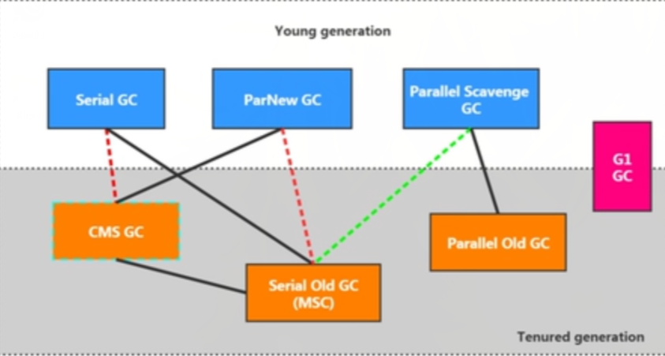
            
            垃圾收集器的组合关系（按上图）：
                1,两个收集器间有连线,表明它们可以搭配使用:Serial/Serial old, Serial/CMS, ParNew/Serial old,
                ParNew/CMS、Parallel scavenge/Serial old, Parallel Scavenge/Parallel old, G1。
                2,其中Serial old作为CMS出现"Concurrent Mode Failure"失败的后备预案。
                3, (红色虚线)由于维护和兼容性测试的成本,在JDK 8时将Serial+CMS， ParNew+Serial old
                这两个组合声明为废弃(JEP 173) ,并在JDK 9中完全取消了这些组合的支持(JEP214),即移除。
                4, (绿色虚线)JDK 14中:弃用Parallel Scavenge和Serialold GC组合(JEP3665,
                (青色虚线)JDK 14中: 删除CMS垃圾回收器 (JEP 363)
            
            如何查看默认的垃圾收集器：
                -XX:+PrintCommandLineFlags : 查看命令行相关参数（包含使用的垃圾收集器）
                使用命令行指令： jinfo -flag 相关垃圾回收器参数  进程id
                
            Serial回收器： 串行回收
                Serial收集器是最基本。历史最悠久的垃圾收集器。jdk1.3之前回收新生代唯一的选择。
                Serial收集器作为HotSpot中的Client模式下的默认新生代垃圾收集器。
                Serial收集器采用复制算法，串行回收和STW机制的方式执行内存回收。
                除了年轻代之外，Serial收集器还提供用于执行老年代垃圾收集的Serial Old收集器。
                Serial Old收集器同样也采用了串行回收和STW机制，只不过内存回收算法使用的是标记-压缩算法。
                Serial收集器作为HotSpot中的Client模式下的默认老年代垃圾收集器
                Serial Old在Server模式下主要有两个用途： 1.与新生代的Serial收集器配合使用
                2.作为老年代CMS收集器的后备垃圾收集方案。
                
                优势: 简单而高效(与其他收集器的单程比),对于限定单个CPU的环境来说, 
                Serial收集器由于没有线程交互的开销,专心做垃圾收集自然可以获得最高的单线程收集效率。
                >运行在Client模式下的虚拟机是个不错的选择。在用户的桌面应用场景中,可用内存一般不大(几十MB至一两百MB),
                可以在较短时间内完成垃圾收集(几十ms至一百多ms) ,只要不频繁发生使用串行回收器是可以接受的。
                在HotSpot虚拟机中, 使用-xx:+UseSerialGC参数可以指定年轻代和老年代都使用串行收集器。
                >等价于新生代用Serial GC,且老年代用Serial Old GC.
                
            ParNew回收器： 并行回收
                如果说Serial GC是年轻代中的单线程垃圾收集器,那么ParNew收集器则是Serial收集器的多线程版本。
                > Par是Parallel的缩写, New是只能处理的是新生代. ParNew收集器除了采用并行回收的方式执行内存回收外,
                两款垃圾收集器之间几乎没有任何区别。ParNew收集器在年轻代中同样也是采用复制算法、"stop-the-World"机制。
                ParNew是很多JVM运行在Server模式下新生代的默认垃圾收集器。
                在程序中，开发人员可以通过选项 -XX:+UseParNewGC 手动指定使用ParNew收集器执行内存回收任务。
                它代表年轻代使用并行收集器，不影响老年代。
                -XX:ParallelGCThreads 限制线程数量，默认开启和cpu数据相同的线程数。
                
            Parallel Scavenge回收器： 吞吐量优先
                HotSpot的年轻代中除了拥有ParNew收集器是基于并行回收的以外，Parallel Scavenge收集器同样也采用了复制算法，
                并行回收和STW机制。 和ParNew收集器不同，Parallel Scavenge收集器的目标则是达到一个可控制的吞吐量，
                它也被称为吞吐量优先的垃圾收集器。
                自适应调节策略也是Parallel Scavenge与ParNew一个重要区别。
                
                高吞吐量则可以高效率地利用CPU时间,尽快完成程序的运算任务,主要适合在后台运算而不需要太多交互的任务。
                因此,常见在服务器环境中使用。例如,那些执行批量处理、订单处理、工资支付、科学计算的应用程序。
                Parallel收集器在JDK1.6时提供了用于执行老年代垃圾收集的Parallel Old收集器,
                用来代替老年代的Serial Old收集器。Parallel Old收集器采用了标记-压缩算法,
                但同样也是基于并行回收和"stop-the-World"机制。
                
                在程序吞吐量优先的应用场景中, Parallel收集器和Parallel Old收集器的组合,
                在Server模式下的内存回收性能很不错。在Java8中,默认就是此垃圾收集器。
                
                参数配置：
                    -XX:+UseParallelGC 手动指定年轻代使用Parallel并行收集器执行内存回收任务。
                    -XX:+UseParallelOldGC 手动指定老年代都是使用并行回收收集器。
                    >分别适用于新生代和老年代。默认jdk8是开启的。
                    >上面两个参数,默认开启一个,另一个也会被开启。(互相激活)
                    
                    -XX:ParallelGCThreads设置年轻代并行收集器的线程数。一般地,最好与CPU数量相等,
                    以避免过多的线程数影响垃圾收集性能。
                    >在默认情况下,当CPU数量小于8个, ParallelGCThreads的值等于CPU数量。
                    当CPU数量大于8个, ParallelGCThreads的值等于 3 + [5*CPU_Count]/8]。
                    
                    -XX:MaxGCPauseMills 设置垃圾收集器最大停顿时间（STW）。单位为毫秒。
                    为了尽可能地把停顿时间控制在 MaxGCPauseMills以内,收集器在工作时会调整Java堆大小或者其他一些参数。
                    对于用户来讲,停顿时间越短体验越好。但是在服务器端,我们注重高并发,整体的吞吐量。
                    所以服务器端适合Parallel 进行控制。该参数使用需谨慎。
            
                    -XX:GCTimeRatio 垃圾收集时间占总时间的比例(=1 / (N + 1) )。用于衡量吞吐量的大小。
                    >取值范围(0, 1) 。默认值99%, 也就是垃圾回收时间不超过1%。
                    >与前一个-XX:MaxGCPauseMillis参数有一定矛盾性。暂停时间越长, Radio参数就容易超过设定的比例。
                    
                    -XX:+UseAdaptiveSizePolicy 设置 Parallel Scavenge收集器具有自适应调节策略。
                    在这种模式下,年轻代的大小、Eden和Survivor的比例、晋升老年代的对象年龄等参数会被自动调整,
                    已达到在堆大小、吞吐量和停顿时间之间的平衡点。在手动调优比较困难的场合,可以直接使用这种自适应的方式,
                    仅指定虚拟机的最大堆、目标的吞吐量(GCTimeRatio)和停顿时间(MaxGCPauseMills) ,让虚拟机自己完成调优工作。
                    
            CMS回收器： 低延迟
                在JDK1.5时期, Hotspot推出了一款在强交互应用中几乎可认为有划时代意义的垃圾收集器:
                CMS (Concurrent-Mark-Sweep)收集器,这款收集器是HotSpot虚拟机中第一款真正意义上的并发收集器,
                它第一次实现了让垃圾收集线程与用户线程同时工作。CMS收集器的关注点是尽可能缩短垃圾收集时用户线程的停顿时间。
                停顿时间越短(低延迟)就越适合与用户交互的程序, 良好的响应速度能提升用户体验。
                >目前很大一部分的Java应用集中在互联网站或者B/S系统的服务端上,这类应用尤其重视服务的响应速度,
                希望系统停顿时间最短,以给用户带来较好的体验。CMS收集器就非常符合这类应用的需求。
                CMS的垃圾收集算法采用标记-清除算法,并且也会"stop-the-world"。
                
                不幸的是, CMS作为老年代的收集器,无法与JDK1.4.0中已经存在的新生代收集器Parallel scavenge配合工作,
                所以在JDK1.5中使用CMS来收集老年代的时候,新生代只能选择ParNew或者Serial收集器中的一个。
                在G1出现之前, CMS使用还是非常广泛的。一直到今天,仍然有很多系统使用CMS GC. 
                
                CMS工作原理：     
                    CMS整个过程比之前的收集器要复杂,整个过程分为4个主要阶段,即初始标记阶段、并发标记阶段、
                    重新标记阶段和并发清除阶段。
                    
                    初始标记(Initial-Mark)阶段: 在这个阶段中,程序中所有的工作线程都将会因为"Stop-the-Wor1d"
                    机制而出现短暂的暂停,这个阶段的主要任务仅仅只是标记出 GC Roots能直接关联到的对象。
                    一旦标记完成之后就会恢复之前被暂停的所有应用线程。由于直接关联对象比较小,所以这里的速度非常快。
                    
                    并发标记(Concurrent-Mark)阶段:从GC Roots的直接关联对象开始遍历整个对象图的过程,
                    这个过程耗时较长但是不需要停顿用户线程,可以与垃圾收集线程一起并发运行。
                    
                    重新标记( Remark)阶段: 由于在并发标记阶段中,程序的工作线程会和垃圾收集线程同时运行或者交叉运行,
                    因此为了修正并发标记期间,因用户程序继续运作而导致标记产生变动的那一部分对象的标记记录,
                    这个阶段的停顿时间通常会比初始标记阶段稍长一些,但也远比并发标记阶段的时间短。
                    
                    并发清除(Concurrent-Sweep)阶段: 此阶段清理删除掉标记阶段判断的已经死亡的对象,释放内存空间。
                    由于不需要移动存活对象,所以这个阶段也是可以与用户线程同时并发的。
                    
                    尽管CMS收集器采用的是并发回收(非独占式),但是在其初始化标记和再次标记这两个阶段中仍然需要执行
                    "stop-the-world"机制暂停程序中的工作线程,不过暂停时间并不会太长,
                    因此可以说明目前所有的垃圾收集器都做不到完全不需要"stop-the-world" ,只是尽可能地缩短暂停时间。
                    由于最耗费时间的并发标记与并发清除阶段都不需要暂停工作,所以整体的回收是低停顿的。
                    另外,由于在垃圾收集阶段用户线程没有中断,所以在CMS回收过程中,还应该确保应用程序用户线程有足够的内存可用。
                    因此, CMS收集器不能像其他收集器那样等到老年代几乎完全被填满了再进行收集,而是当堆内存使用率达到某一阈值时,
                    便开始进行回收,以确保应用程序在CMS工作过程中依然有足够的空间支持应用程序运行。
                    要是CMS运行期间预留的内存无法满足程序需要,就会出现一次"Concurrent Mode Failure"失败,
                    这时虚拟机将启动后备预案: 临时启用Serial Old收集器来重新进行老年代的垃圾收集,这样停顿时间就很长了。
                    
                    CMS收集器的垃圾收集算法采用的是标记-滑除算法,这意味者每次执行完内存回收后,
                    由于被执行内存回收的无用对象所占用的内存空间极有可能是不连续的一些内存块,不可避免地将会产生一些内存碎片。
                    那么采用了CMS后自动分配内存机制在为新对象分配内存空间时,将无法使用指针碰撞(Bump the Pointer)技术,
                    而只能够选择空闲列表(Free List)执行内存分配。
                    
                CMS的优点：
                    并发收集，低延迟
                CMS的弊端:
                    1。会产生内存碎片,导致并发清除后,用户线程可用的空间不足。在无法分配大对象的情况下,不得不提前触发Full GC.
                    2。CMS收集器对CPU资源非常敏感。在并发阶段,它虽然不会导致用户停顿,
                    但是会因为占用了一部分线程而导致应用程序变慢,总吞吐量会降低。
                    3。CMS收集器无法处理浮动垃圾。可能出现"Concurrent Mode Failure"失败而导致另一次Full GC的产生。
                    在并发标记阶段由于程序的工作线程和垃圾收集线程是同时运行或者交叉运行的,
                    那么在并发标记阶段如果产生新的垃圾对象, CMS将无法对这些垃圾对象进行标记,
                    最终会导致这些新产生的垃圾对象没有被及时回收, 从而只能在下一次执行GC时释放这些之前未被回收的内存空间。
                
                CMS收集器可以设置的参数：
                    -XX:+UseConcMarkSweepGC 手动指定使用CMS收集器执行内存回收任务。
                    开启该参数后会自动将-XX:+UseParNewGC打开，
                    即 ParNew（young区）+ CMS（Old区）~ Serial Old（Old区）组合。
                    
                    -XX:CMSInitiatingOccupancyFraction 设置堆内存使用率的阈值,一旦达到该阈值,便开始进行回收。
                    > JDK5及以前版本的默认值为 0.68,即当老年代的空间使用率达到68%时,会执行一次CMS回收。
                    JDK6及以上版本默认值为 92%。
                    >如果内存增长缓慢,则可以设置一个稍大的值,大的阈值可以有效降低CMS的触发频率,
                    减少老年代回收的次数可以较为明显地改善应用程序性能。反之,如果应用程序内存使用率增长很快,
                    则应该降低这个阈值,以避免频繁触发老年代串行收集器。因此通过该选项便可以有效降低Ful1 GC的执行次数。
                    
                    -XX:+UseCMSCompactAtFullCollection 用于指定在执行完FullGC后对内存空间进行压缩整理,
                    以此避免内存碎片的产生。不过由于内存压缩整理过程无法并发执行,所带来的问题就是停顿时间变得更长了。
                    
                    -XX:CMSFullGCsBeforeCompaction 设置在执行多少次Ful1 GC后对内存空间进行压缩整理。
                    
                    -XX:ParallelCMSThreads 设置CMS的线程数量。
                    > CMs默认启动的线程数是(ParallelGCThreads+3) /4,
                    ParallelGCThreads是年轻代并行收集器的线程数。当CPU资源比较紧张时,
                    受到CMS收集器线程的影响,应用程序的性能在垃圾回收阶段可能会非常糟糕。             
            
            三种收集器的选择：
                如果想要最小化地使用内存和并行开销，就选Serial GC。
                如果想要最大化应用程序的吞吐量，就选Parallel GC。
                如果想要最小化GC的中断或停顿时间，就选CMS GC。
                
            G1回收器： 区域化分代式
                对于应用程序所应对的业务越来越大，复杂，用户越来越多，没有GC就不能保证应用程序正常进行，而经常造成STW的GC
                又跟不上实际需求，所以才会不断地尝试对GC进行优化。与此同时，为了适应现在不断扩大的内存和不断增加的处理器数量，
                进一步降低暂停时间同时兼顾良好的吞吐量。官方给出了G1垃圾收集器，并给G1设定的目标是在延迟可控的情况下
                获得尽可能高的吞吐量，所以才担当了全功能收集器的重任。
                
                G1叫做 Garbage First，因为G1是一个并行回收器，它把堆内存分割为很多不相关的区域(Region)（物理上不连续）。
                使用不同的Region来表示Eden， Survivor0， Survivor1， Old区等。
                G1 GC有计划地避免在整个java堆中进行全区域地垃圾收集。 G1跟踪各个region里面的垃圾堆积的价值大小
                （回收所获得的空间大小以及回收所需时间的经验值），在后台维护一个优先列表，
                每次根据允许的收集时间，优先回收价值最大的region。   
                由于这种方式的侧重点在于回收垃圾最大量的区间（region），所以给G1一个名字： 垃圾优先（Garbage First）。              
                    
                Gl (Garbage-First)是一款面向服务端应用的垃圾收集器,主要针对配备多核CPU及大容量内存的机器,
                以极高概率满足GC停顿时间的同时,还兼具高吞吐量的性能特征。
                在JDK1.7版本正式启用,移除了Experimental的标识,是JDK 9以后的默认垃圾回收器,
                取代了CMS回收器以及Parallel + Parallel old组合。被oracle官方称为“全功能的垃圾收集器”。
                与此同时, CMS已经在JDK 9中被标记为废弃(deprecated)。
                在jdk8中还不是默认的垃圾回收器,需要使用 -XX:UseG1GC来启用。
                
                与其他GC收集器相比，G1使用了全新的分区算法，其特点如下。
                    并行与并发
                        >并行性: G1在回收期间,可以有多个GC线程同时工作,有效利用多核计算能力。此时用户线程STW。
                        >并发性: G1拥有与应用程序交替执行的能力,部分工作可以和应用程序同时执行,因此,一般来说,
                        不会在整个回收阶段发生完全阻塞应用程序的情况。
                    分代收集
                        >从分代上看, G1依然属于分代型垃圾回收器,它会区分年轻代和老年代,年轻代依然有Eden区和Survivor区。
                        但从堆的结构上看,它不要求整个Eden区、年轻代或者老年代都是连续的,也不再坚持固定大小和固定数量。
                        >将堆空间分为若干个区域(Region) ,这些区域中包含了逻辑上的年轻代和老年代。
                        >和之前的各类回收器不同,它同时兼顾年轻代和老年代。对比其他回收器,G1即可工作在年轻代,又可工作在老年代;
                    空间整合
                        G1将内存划分为一个个的region。内存的回收是以region作为基本单位的。region之间是使用复制算法的，
                        但整体上实际可看作是标记-压缩算法，两种算法都可以避免内存碎片。这种特性有利于程序长时间运行，
                        分配大对象时不会因为无法找到连续内存空间而提前触发下一次GC，尤其时当java堆非常大的时候，G1的优势更明显。
                    可预测的停顿时间模型（弱实时soft real-time）
                        这是G1相对于CMS的另一大优势, G1除了追求低停顿外,还能建立可预测的停顿时间模型,
                        能让使用者明确指定在一个长度为M毫秒的时间片段内,消耗在垃圾收集上的时间不得超过N毫秒。
                        >由于分区的原因, G1可以只选取部分区域进行内存回收,这样缩小了回收的范围,
                        因此对于全局停顿情况的发生也能得到较好的控制。
                        G1跟踪各个Region里面的垃圾堆积的价值大小(回收所获得的空间大小以及回收所需时间的经验值),
                        在后台维护一个优先列表,每次根据允许的收集时间,优先回收价值最大的Region.
                        保证了G1收集器在有限的时间内(比如 N毫秒内)可以获取尽可能高的收集效率。
                        >相比于CMS GC, G1未必能做到CMS在最好情况下的延时停顿,但是最差情况要好很多。
                        
                相较于CMS, G1还不具备全方位、压倒性优势。比如在用户程序运行过程中,
                G1无论是为了垃圾收集产生的内存占用(Footprint)还是程序运行时的额外执行负载(Overload)都要比CMS要高。
                从经验上来说,在小内存应用上CMS的表现大概率会优于G1,而G1在大内存应用上则发挥其优势，平衡点在6-8GB之间。
                
                
                G1回收的参数设置
                    -XX:+UseG1GC  手动指定使用G1收集器执行内存回收任务。
                    
                    -XX:G1HeapRegionSize  设置每个Region的大小。值是2的幂，范围是1MB到32MB之间，
                    目标是根据最小的Java堆大小划分出约2048个区域。默认是堆内存的1/2000.
                    
                    -XX:MaxGCPauseMil1is  设置期望达到的最大GC停顿时间指标(JVM会尽力实现,但不保证达到)。默认值是200ms。
                    
                    -XX:ParallelGCThread 设置在STW时工作线程数的值。最多设置为8.
                    
                    -XX:ConcGCThreads 设置并发标记的线程数。将n设置为并行垃圾回收线程数(ParallelGCThreads)的1/4左右。
                    
                    -XX:InitiatingHeapOccupancyPercent 设置触发并发GC周期的Java堆占用率阀值。超过此值,就触发GC.默认值是45.        
                            
                G1回收器的适用场景
                    面向服务端应用,针对具有大内存、多处理器的机器。(在普通大小的堆里表现并不惊喜)
                    最主要的应用是需要低GC延迟,并具有大堆的应用程序提供解决方案;
                    如:在堆大小约6GB或更大时,可预测的暂停时间可以低于0.5秒; 
                    (G1通过每次只清理一部分而不是全部的Region的增量式清理来保证每次GC停顿时间不会过长)。
                    用来替换掉JDK1.5中的CMS收集器，在下面的情况时,使用G1可能比CMS好:
                        1.超过50%的Java堆被活动数据占用。
                        2.对象分配频率或年代提升频率变化很大。
                        3.GC停顿时间过长(长于0.5至1秒)。
                    HotSpot垃圾收集器里,除了G1以外,其他的垃圾收集器使用内置的JVM线程执行GC的多线程操作,而
                    G1 GC可以采用应用线程承担后台运行的GC工作, 即当JVM的GC线程处理速度慢时,
                    系统会调用应用程序线程帮助加速垃圾回收过程。
                    
                分区（region）： 化整为零 
                    使用G1收集器时， 它将整个Java堆划分成约2048个大小相同的独立region块，
                    每个region块大小根据堆空间的实际大小而定，整体被控制在1MB到32MB之间，且为2的N次幂，即1MB，2MB，4MB等。
                    可以通过 -XX:G1HeapRegionSize 设定。 所有的Region大小相同，且在jvm生命周期内不会被改变。
                    虽然还保留有新生代和老年代的概念，但新生代和老年代不再是物理隔离的，它们都是一部分Region的集合。
                    通过Region的动态分配方案实现逻辑上的连续。
                    一个region有可能属于Eden，Survivor，Old内存区域，但是一个region只可能属于一个角色。
                    G1垃圾收集器增加了一种新的内存区域，叫做Humongous内存区域，主要用于存储大对象，
                    如果超过1.5个region就放到Humongous内存区域。
                    对于堆中的大对象,默认直接会被分配到老年代,但是如果它是一个短期存在的大对象,就会对垃圾收集器造成负面影响。
                    为了解决这个问题, G1划分了一个Humongous区,它用来专门存放大对象。如果一个Humongous区装不下一个大对象,
                    那么G1会寻找连续的Humongous区来存储。为了能找到连续的Humongous区,有时候不得不启动Full GC.
                    G1的大多数行为都把Humongous区作为老年代的一部分来看待。

                G1回收器垃圾回收过程
                    G1 GC的垃圾回收过程主要包括如下三个环节：
                        年轻代GC（Young GC）
                        老年代并发标记过程（Concurrent Marking）
                        混合回收（Mixed GC）
                        (如果需要，单线程，独占式，高强度的Full GC还是继续存在的。
                        它是针对GC的评估失败提供了一种失败的保护机制，即清理回收)
                        
                    应用程序分配内存,当年轻代的Eden区用尽时开始年轻代回收过程:
                    G1的年轻代收集阶段是一个并行的独占式收集器。在年轻代回收期, G1 GC暂停所有应用程序线程,
                    启动多线程执行年轻代回收。然后从年轻代区间移动存活对象到Survivor区间或者老年区间,
                    也有可能是两个区间都会涉及。当堆内存使用达到一定值(默认45%)时,开始老年代并发标记过程。
                    标记完成马上开始混合回收过程。对于一个混合回收期, G1 GC从老年区间移动存活对象到空闲区间,
                    这些空闲区间也就成为了老年代的一部分。和年轻代不同,老年代的G1回收器和其他GC不同, 
                    G1的老年代回收器不需要整个老年代被回收,一次只需要扫描/回收一小部分老年代的Region就可以了。
                    同时,这个老年代Region是和年轻代是一起被回收的。 
                
                    Remembered Set：
                        无论G1还是其他分代收集器，jvm都是使用Remembered Set来避免全局扫描。
                        关于G1，每个region都有一个对应的Remembered Set。
                        每次Reference类型数据写操作时，都会产生一个Write Barrier暂时中断操作。
                        然后检查将要写入的引用指向的对象是否和该Reference类型数据在不同的Region
                        (其他收集器则检查老年代对象是否引用了新生对象)。
                        如果不同，通过CardTable把相关引用信息记录到引用指向对象的所在Region对应的Remembered Set中
                       （就是在自己身上记录与别人的关系）。
                        当进行垃圾收集时，在GC根节点的枚举范围加入Remembered Set，就可以保证不进行全局扫描，也不会有遗漏。
                                               
                    G1回收过程之YoungGC：
                        jvm启动时，G1先准备好Eden区，程序在运行过程中不断创建对象到Eden区，
                        当Eden空间耗尽时，G1会启动一次年轻代垃圾回收过程。
                        年轻代垃圾回收只会回收Eden区与Survivor区。
                        YGC时，首先G1停止应用程序的执行（STW），G1创建回收集（Collection Set），
                        回收集是指需要被回收的内存分段的集合，年轻代回收过程的回收集包含年轻代Eden区和Survivor区所有的内存分段。
                            
                        具体回收过程: 
                            >第一阶段,扫描根。根是指static变量指向的对象,正在执行的方法调用链条上的局部变量等。
                            根引用连同RSet记录的外部引用作为扫描存活对象的入口
                            >第二阶段,更新RSet.处理dirty card queue中的card,更新RSet.此阶段完成后, 
                            RSet可以准确的反映老年代对所在的内存分段中对象的引用。
                            >第三阶段,处理RSet.识别被老年代对象指向的Eden中的对象,这些被指向的Eden中的对象被认为是存活的对象。
                            >第四阶段,复制对象.此阶段,对象树被遍历, Eden区内存段中存活的对象会被复制到Survivor区中空的内存分段,
                            Survivor区内存段中存活的对象如果年龄未达阔值,年龄会加1,达到阀值会被会被复制到old区中空的内存分段。
                            如果survivor空间不够, Eden空间的部分数据会直接晋升到老年代空间。
                            >第五阶段,处理引用。处理Soft. Weak, Phantom, Final, JNI Weak等引用。
                            最终Eden空间的数据为空, GC停止工作,而目标内存中的对象都是连续存储的,没有碎片,
                            所以复制过程可以达到内存整理的效果,减少碎片.
                            
                    G1回收过程之并发标记：        
                        1,初始标记阶段:标记从根节点直接可达的对象。这个阶段是STM的,并且会触发一次年轻代GC.
                        2,根区域扫描(Root Region Scanning) : G1 GC扫描（Survivor区直接可达的）老年代区域对象,
                        并标记被引用的对象。这一过程必须在Young GC之前后完成。
                        3,并发标记(Concurrent Marking): 在整个堆中进行并发标记(和应用程序并发执行),
                        此过程可能被young GC中断。在并发标记阶段,若发现区域中的所有对象都是垃圾,
                        那这个区域会被立即回收。同时,并发标记过程中,会计算每个区域的对象活性(区域中存活对象的比例)
                        4,再次标记(Remark): 首先会STW，由于应用程序持续进行,需要修正上一次的标记结果. 
                        G1中采用了比CMS更快的初始快照算法:snapshot-at-the-beginning (SATB).
                        5,独占清理(cleanup,STW): 计算各个区域的存活对象和GC回收比例,并进行排序,
                        识别可以混合回收的区域。为下阶段做铺垫。这个阶段并不会实际上去做垃圾的收集。
                        6,并发清理阶段:识别并清理完全空闲的区域。
                        
                    G1回收过程之混合回收：
                        当越来越多的对象晋升到Old region时,为了避免堆内存被耗尽,虚拟机会触发一个混合的垃圾收集器,
                        即Mixed GC,该算法并不是一个Old GC,除了回收整个Young Region,还会回收一部分的Old Region.
                        这里需要注意: 是一部分老年代,而不是全部老年代。可以选择性的进行Old Region收集,
                        从而可以对垃圾回收的耗费时间进行控制。还要注意的是Mixed GC并不是Full GC.
                        
                        并发标记结束以后,老年代中百分百为垃圾的内存分段被回收了,部分为垃圾的内存分段被计算了出来。
                        默认情况下,这些老年代的内存分段会分8次(可以通过-XX:G1MixedGCCountTarget设置)被回收。
                        混合回收的回收集(collection Set)包括八分之一的老年代内存分段和 Eden区内存分段, survivor区内存分段。
                        混合回收的算法和年轻代回收的算法完全一样,只是回收集多了老年代的内存分段。
                        由于老年代中的内存分段默认分8次回收, G1会优先回收垃圾多的内存分段。
                        垃圾占内存分段比例越高的,越会被优先回收。并且有一个阈值会决定内存分段是否被回收,
                        -XX:G1MixedGCLiveThresholdPercent,默认为65%,意思是垃圾占内存分段比例要达到65%才会被回收。
                        如果垃圾占比太低,意味着存活的对象占比高,在复制的时候会花费更多的时间。
                        混合回收并不一定要进行8次。有一个阈值 -XX:G1HeapwastePercent,默认值为10%.
                        意思是允许整个堆内存中有10%的空间被浪费,意味着如果发现可以回收的垃圾占堆内存的比例低于10%,
                        则不再进行混合回收。因为GC会花费很多的时间但是回收到的内存却很少。
                    
                    G1可选回收过程之Full GC：
                        G1的初衷就是要避免Full GC的出现。但是如果上述方式不能正常工作, 
                        G1会停止应用程序的执行(stop-The-World) ,使用单线程的内存回收算法进行垃圾回收,
                        性能会非常差,应用程序停顿时间会很长。
                        要避免Full Gc的发生,一旦发生需要进行调整。什么时候会发生Full GC呢?
                        比如堆内存太小,当G1在复制存活对象的时候没有空的内存分段可用,则会回退到full gc,
                        这种情况可以通过增大内存解决。
                        导致G1 Full GC的原因可能有两个:
                            1. Evacuation的时候没有足够的to-space来存放晋升的对象;
                            2.并发处理过程完成之前空间耗尽。    
                        
                    固定的年轻代的大小会覆盖暂停时间目标，避免使用 -Xmn或-XX:NewRatio等相关选项显示设置年轻代大小。
                    
            7种经典垃圾回收器总结                
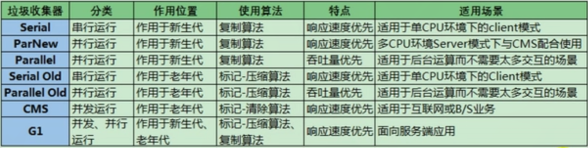
        
        4.GC日志分析：
            通过阅读GC日志，可以了解Java虚拟机内存分配与回收策略。
            内存分配与垃圾回收的参数列表
            -XX:+PrintGC                    输出GC日志，类似， -verbose:gc
            -XX:+PrintGCDetails             输出GC的详细信息
            -XX:+PrintGCTimeStamps          输出GC的时间戳(jvm启动开始)
            -XX:+PrintGCDateStamps          输出GC的时间戳
            -XX:+PrintHeapAtGC              在进行GC的前后打印出堆的信息
            -Xloggc:./logs/gc.log          日志文件的输出路径
           
        5.新时期的垃圾收集器
            Shenandoah GC： 
                Open JDK12的Shenandoah GC时低停顿时间的GC (实验性)。
                Shenandoah,无疑是众多GC中最孤独的一个。是第一款不由Oracle公司团队领导开发的HotSpot垃圾收集器。
                不可避免的受到官方的排挤。比如号称OpenJDK和oracleJDK没有区别的oracle公司仍拒绝在oracleJDK12中支持shenandoah.
                Shenandoah垃圾回收器最初由RedHat进行的一项垃圾收集器研究项目PauselesGC的实现,
                旨在针对JVM上的内存回收实现低停顿的需求。在2014年贡献给OpenJDK.
                Red Hat研发Shenandoah团队对外宣称, Shenandoah垃圾回收器的暂停时间与堆大小无关,
                这意味着无论将堆设置为200 MB还是200GB, 99.9%的目标都可以把垃圾收集的停顿时间限制在十毫秒以内。
                不过实际使用性能将取决于实际工作堆的大小和工作负载。    
                Shenandoah GC 的弱项是高运行负担下的吞吐量下降。强项就是低延迟时间。
                
            ZGC： 
               ZGC与shenandoah目标高度相似,在尽可能对吞吐量影响不大的前提下,
               实现在任意堆内存大小下都可以把垃圾收集的停顿时间限制在十毫秒以内的低延迟。
               《深入理解Java虚拟机》一书中这样定义ZGC: ZGC收集器是一款基于Region内存布局的, (暂时)不设分代的,
               使用了读屏障、染色指针和内存多重映射等技术来实现可并发的标记-压缩算法的,
               以低延迟为首要目标的一款垃圾收集器。
               ZGC的工作过程可以分为4个阶段:并发标记-并发预备重分配-并发重分配-并发重映射。
               ZGC几乎在所有地方并发执行的,除了初始标记的是STW的。所以停顿时间几乎就耗费在初始标记上,这部分的实际时间是非常少的。     
            。。。
 
 ## Class字节码文件
    字节码指令
        java虚拟机由一个字节码长度的，代表着某个特定操作含义的操作码（opcode）
        以及跟随其后的零至多个代表此操作所需参数的操作数（operand）所构成。
        虚拟机中许多指令并不包含操作数，只有一个操作码。
    
    class字节码文件结构
        - 魔数（magic）
        - Class文件版本
        - 常量池
        - 访问标志
        - 类索引，父类索引，接口索引集合
        - 字段表集合（Fields）
        - 方法表集合（Methods）
        - 属性集合（attributes）
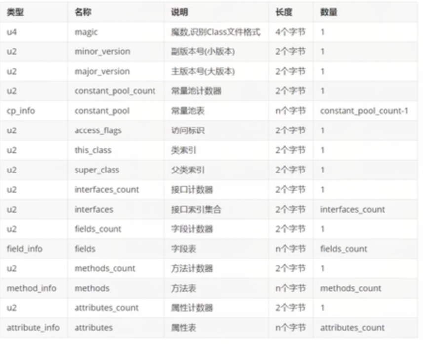
 
    例，class文件的内容       
        cafe babe 0000 0039 0018 0a00 0200 0307      
        0004 0c00 0500 0601 0010 6a61 7661 2f6c
        616e 672f 4f62 6a65 6374 0100 063c 696e
        6974 3e01 0003 2829 5607 0008 0100 2163
        6f6d 2f6c 6561 726e 2f6a 6176 612f 5374
        6163 6b53 7472 7563 7475 7265 5465 7374
        0100 0443 6f64 6501 000f 4c69 6e65 4e75
        6d62 6572 5461 626c 6501 0012 4c6f 6361
        6c56 6172 6961 626c 6554 6162 6c65 0100
        0474 6869 7301 0023 4c63 6f6d 2f6c 6561
        726e 2f6a 6176 612f 5374 6163 6b53 7472
        7563 7475 7265 5465 7374 3b01 0004 6d61
        696e 0100 1628 5b4c 6a61 7661 2f6c 616e
        672f 5374 7269 6e67 3b29 5601 0004 6172
        6773 0100 135b 4c6a 6176 612f 6c61 6e67
        2f53 7472 696e 673b 0100 0169 0100 0149
        0100 016b 0100 0171 0100 0a53 6f75 7263
        6546 696c 6501 0017 5374 6163 6b53 7472
        7563 7475 7265 5465 7374 2e6a 6176 6100
        2100 0700 0200 0000 0000 0200 0100 0500
        0600 0100 0900 0000 2f00 0100 0100 0000
        052a b700 01b1 0000 0002 000a 0000 0006
        0001 0000 000c 000b 0000 000c 0001 0000
        0005 000c 000d 0000 0009 000e 000f 0001
        0009 0000 005f 0002 0004 0000 000b 100a
        3c10 0a3d 1b1c 603e b100 0000 0200 0a00
        0000 1200 0400 0000 0e00 0300 0f00 0600
        1000 0a00 1100 0b00 0000 2a00 0400 0000
        0b00 1000 1100 0000 0300 0800 1200 1300
        0100 0600 0500 1400 1300 0200 0a00 0100
        1500 1300 0300 0100 1600 0000 0200 17    
        
    Class文件的标识： 魔数（magic number）
        每个Class文件开头的4个字节的无符号整数称为魔数，它的唯一作用是确定这个文件是否为一个能被虚拟机接受的有效合法的Class文件，
        即，魔数是Class文件的标识符。魔数值固定为十六进制的 CA FE BA BE。如果一个Class文件不以0xCAFEBABE开头，
        虚拟机在进行文件校验的时候就会直接抛出请求： ERROR: A JNI error has occurred, please check your installation... 
        使用魔数而不是扩展名来进行识别主要是基于安全方面的考虑，因为文件扩展名可以随意地改动。
        
    Class文件版本：    
        紧接着魔数后的4个字节存储的是Class文件的版本号，同样也是4个字节。
        第5个和第6个字节码所代表的含义就是编译的副版本号minor_version, 而第7个和第8个字节就是编译的主版本号major_version.
        它们共同构成了class文件的格式版本号。
        
        不同的版本的Java编译器编译的Class文件对应的版本是不一样的，目前，高版本的Java虚拟机可以执行由低版本编译器生成的Class文件，
        但是低版本的Java虚拟机不能执行由高版本编译器生成的Calss文件，否则jvm会抛出java.lang.UnsupportedClassVersionError异常。
        jdk版本为 1.n (n>=2)时，对应的class文件格式版本号为 44+n.0 
            
    Class文件的常量池：
        常量池是Class文件中内存最为丰富的区域之一，常量池对于Class文件中的字段和方法解析也有着至关重要的作用。
        随着java虚拟机的不断发展，常量池的内存也日渐丰富，可以说，常量池是整个Class文件的基石。
        在版本号之后，紧跟着的是常量池的数量，以及若干个常量池表项，常量池中的常量是不固定的，
        所以在常量池的入口需要放置一项u2类型的无符号数，代表常量池容量计数值（constant_pool_count），
        与java中语言习惯不一样的是，这个容量计数是从1而不是0开始的。
        Class文件使用了一个前置的容量计数器（constant_pool_count）加若干个连续的数据项（constant_pool）的形式来描述常量池内存，
        这一系列连续的常量池数据称为常量池集合。
        常量池表项中，用于存放编译时期生成的各种字面量和符号引用，这部分内存将在类加载后进入方法区的运行时常量池中存放。
        
        容量计数器（constant_pool_count）
            由于常量池的数据不固定，时长时短，所以需要放置两个字节来表示常量池容量计数值。
            常量池容量计数值（u2类型），从1开始，表示常量池中由多少项常量，即constant_pool_count=1表示常量池中有0个常量项。
            常量池容量计数值的 0项空出来的，是为了表示 "不引用任何一个常量池项目" 的含义。
            
        常量池表（constants_pool）
            constant_pool是一种表结构，以 1 ~ constant_pool_count -1 为索引，来表明对应的数据项。
            常量池主要存放两大类常量： 字面量（literal）和符号引用（Symbol Reference）。
            它包含了class文件结构及其子结构中引用的所有字符串常量，类或接口名，字段名和其他常量。
            常量池中的每一项都具备相同的特征。第一个字节作为类型标记，用于确定该项的格式，这个字节称为tag byte（标签字节）。
            字面量如文本字符串，声明为final的常量值， 符号引用如类和接口的全限定名，字段的名称和描述符，方法的名称和描述符。
            全限定名如com/learn/Test形式就是类的全限定名，简单名称如方法名或字段名，
            描述符用来描述数据类型，方法的参数列表和返回值。基本数据类型byte标识符B， char标识符C，double标识符D，float标识符F，
            int标识符I，long标识符J, short标识符S，boolean标识符Z，void标识符V，对象类型标识符L，数组标识符 [ 
            
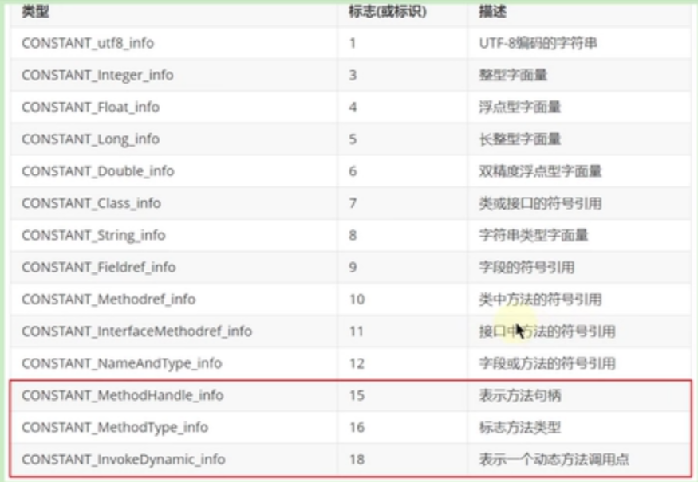            
        
        符号引用: 符号引用以一组符号来描述所引用的目标,符号可以是任何形式的字面量,只要使用时能无歧义地定位到目标即可。
        符号引用与虚拟机实现的内存布局无关,引用的目标并不一定已经加载到了内存中.
        
        直接引用: 直接引用可以是直接指向目标的指针、相对偏移或是一个能间接定位到目标的句柄。
        直接引用是与虚拟机实现的内存布局相关的,同一个符号引用在不同的拟机实例上翻译出来的直按引用一般不会相同,
        如果有了直接引用,那说明引用的目标必定已经存在于内存之中了。
        
    Class文件的访问标志：
        在常量池后，紧跟着访问标识，该标记使用两个字节表示，用于识别一些类或者接口层次的访问信息。包括：这个Class是类还是接口，
        是否定义为public类型，是否定义为abstract类型，如果是类的话,是否被声明为final等。
        类的访问权限通常为 ACC_ 开头的常量。每种类型的表示都是通过设置访问标记的32位中的特定位来实现的。
        如，若是public final的类，则标记为 ACC_PUBLIC | ACC_FINAL.
        使用ACC_SUPER可以让类更准确地定位到父类地方法super.method(),现代编译器都会设置并且使用这个标记。
            
    Class文件的类索引，父类索引，接口索引集合：
        类索引，父类索引，接口索引集合对应this_class, super_class, interface_count和interfaces,都是2字节。
        在访问标志后，会指定该类地类别，父类类别以及实现地接口。
        类索引用于确定这类的全限定名，父类索引用于确定这个类的父类的全限定名，由于java语言不允许的多重继承，所以父类索引只有一个，
        除了java.lang.Object之外，所有的Java类都有父类，因此除了java.lang.Object外，所有java类的父类索引都不为0.
            
    Class文件的字段表集合：            
        用于描述接口或类中声明的变量。字段(field)包括类级变量以及实例级变量,
        但是不包括方法内部、代码块内部声明的局部变量。
        字段叫什么名字、字段被定义为什么数据类型,这些都是无法固定的,只能引用常量池中的常量来描述.
        字段表集合它指向常量池索引集合,它描述了每个字段的完整信息,比如字段的标识符、
        访问修饰符(public. private或protected) 、是类变量还是实例交量(static修饰符)、是否是常量(fina1修饰符)等.
    
        字段计数器（fields-count）的值表示当前class文件fields表的成员个数,使用两个字节来表示。
        字段表（fields）中每个成员都是一个field-info结构,用于表示该类或接口所声明的所有类字段或者实例字段,
        不包括方法内部声明的变量,也不包括从父类或父接口继承的那些字段.     
        
    Class文件的方法表集合：    
        在字节码文件中,每一个method-info项都对应着一个类或者接口中的方法信息,
        比如方法的访问修饰符(public.private或protected),方法的返回值类型以及方法的参数信息等.
        如果这个方法不是抽象的或者不是native的,那么字节码中会体现出来.一方面, methods表只描述当前类或接口中声明的方法,
        不包括从父类或父接口继承的方法。另一方面, methods表有可能会出现由编译器自动添加的方法,
        最典型的便是编译器产生的方法信息(比如：类(接口)初始化方法<clinit>()和实例初始化方法<init>)).
     
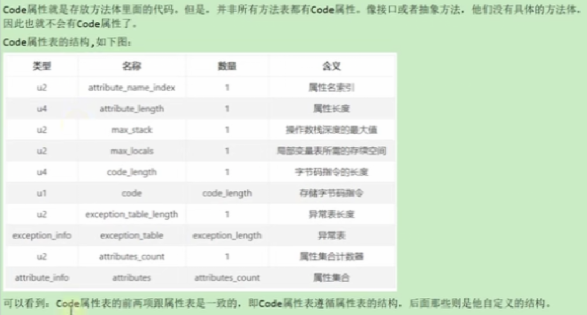
     
    Class文件的属性集合：    
        方法表集合之后的属性表集合,指的是class文件所携带的辅助信息,比如该class文件的源文件的名称,
        以及任何带有RetentionPolicy.CLASS或者RetentionPolicy.RUNTIME的注解,这类信息通常被用于Java虚拟机的验证和运行,
        以及Java程序的调试,一般无须深入了解.
        此外,字段表、方法表都可以有自己的属性表,用于描述某些场景专有的信息.
        属性表集合的限制没有那么严格,不再要求各个属性表具有严格的顺序,
        并且只要不与己有的属性名重复,任何人实现的编译器都可以向属性表中写入自己定义的属性信息,
        但Java虚拟机运行时会忽略掉它不认识的属性.
    
    javap的使用
        通过 javap -help 查看使用。
        使用javap解析的例子：
            Classfile /D:/JAVA/JVM/out/production/chapter11/com/learn/java/JavapTest.class      //字节码文件所属的路径
              Last modified 2020年11月17日; size 855 bytes                                 //最后修改时间，字节码的大小
              SHA-256 checksum a68a2712643f0e8df8e5daa24fd5cd94516bcd5d2f3a4016b6e527d4b678c4ee //SHA-256值
              Compiled from "JavapTest.java"                                //源文件的名称
            public class com.learn.java.JavapTest                               // 完整类定义
              minor version: 0                                                  // 副版本
              major version: 57                                                 //主版本（jdk13）
              flags: (0x0021) ACC_PUBLIC, ACC_SUPER                             //访问标志
              this_class: #10                         // com/learn/java/JavapTest   //类索引
              super_class: #2                         // java/lang/Object          //父类索引
              interfaces: 0, fields: 5, methods: 4, attributes: 1                 // 接口，字段，方法，属性数
            Constant pool:                                                      // 常量池
               #1 = Methodref          #2.#3          // java/lang/Object."<init>":()V
               #2 = Class              #4             // java/lang/Object
               #3 = NameAndType        #5:#6          // "<init>":()V
               #4 = Utf8               java/lang/Object
               #5 = Utf8               <init>
               #6 = Utf8               ()V
               #7 = String             #8             // ok
               #8 = Utf8               ok
               #9 = Fieldref           #10.#11        // com/learn/java/JavapTest.info:Ljava/lang/String;
              #10 = Class              #12            // com/learn/java/JavapTest
              #11 = NameAndType        #13:#14        // info:Ljava/lang/String;
              #12 = Utf8               com/learn/java/JavapTest
              #13 = Utf8               info
              #14 = Utf8               Ljava/lang/String;
              #15 = Fieldref           #10.#16        // com/learn/java/JavapTest.flag:Z
              #16 = NameAndType        #17:#18        // flag:Z
              #17 = Utf8               flag
              #18 = Utf8               Z
              #19 = Fieldref           #20.#21        // java/lang/System.out:Ljava/io/PrintStream;
              #20 = Class              #22            // java/lang/System
              #21 = NameAndType        #23:#24        // out:Ljava/io/PrintStream;
              #22 = Utf8               java/lang/System
              #23 = Utf8               out
              #24 = Utf8               Ljava/io/PrintStream;
              #25 = String             #26            // lsp
              #26 = Utf8               lsp
              #27 = Methodref          #28.#29        // java/io/PrintStream.println:(Ljava/lang/String;)V
              #28 = Class              #30            // java/io/PrintStream
              #29 = NameAndType        #31:#32        // println:(Ljava/lang/String;)V
              #30 = Utf8               java/io/PrintStream
              #31 = Utf8               println
              #32 = Utf8               (Ljava/lang/String;)V
              #33 = String             #34            // olg
              #34 = Utf8               olg
              #35 = Utf8               num
              #36 = Utf8               I
              #37 = Utf8               gender
              #38 = Utf8               C
              #39 = Utf8               COUNTS
              #40 = Utf8               ConstantValue
              #41 = Integer            1
              #42 = Utf8               Code
              #43 = Utf8               LineNumberTable
              #44 = Utf8               LocalVariableTable
              #45 = Utf8               this
              #46 = Utf8               Lcom/learn/java/JavapTest;
              #47 = Utf8               (Z)V
              #48 = Utf8               show
              #49 = Utf8               <clinit>
              #50 = Utf8               SourceFile
              #51 = Utf8               JavapTest.java
            {
              boolean flag;                 // 字段名称
                descriptor: Z               // 字段描述符（类型）
                flags: (0x0000)             // 字段访问标识
            
              protected char gender;
                descriptor: C
                flags: (0x0004) ACC_PROTECTED
            
              public java.lang.String info;
                descriptor: Ljava/lang/String;
                flags: (0x0001) ACC_PUBLIC
            
              public static final int COUNTS;
                descriptor: I
                flags: (0x0019) ACC_PUBLIC, ACC_STATIC, ACC_FINAL
                ConstantValue: int 1                // 常量字段属性： ConstantValue
            
              public com.learn.java.JavapTest();          // <init>
                descriptor: ()V                     // 方法描述符（void）
                flags: (0x0001) ACC_PUBLIC          //访问标识
                Code:                               // 方法的Code属性
                  stack=2, locals=1, args_size=1 // stack：操作数栈的最大深度，locals：局部变量表的长度，args_size参数大小
                     0: aload_0                   // 偏移量：操作码
                     1: invokespecial #1                  // Method java/lang/Object."<init>":()V
                     4: aload_0
                     5: ldc           #7                  // String ok
                     7: putfield      #9                  // Field info:Ljava/lang/String;
                    10: return
                  LineNumberTable:              //行号表
                    line 19: 0                  //指明字节码指令的偏移量于Java源程序中代码行号的对应 
                    line 16: 4
                    line 19: 10
                  LocalVariableTable:               // 局部变量表
                    Start  Length  Slot  Name   Signature           // 开始的位置和结束位置，对应槽位，变量名，描述符
                        0      11     0  this   Lcom/learn/java/JavapTest;
            
              public com.learn.java.JavapTest(boolean);
                descriptor: (Z)V
                flags: (0x0001) ACC_PUBLIC
                Code:
                  stack=2, locals=2, args_size=2
                     0: aload_0
                     1: invokespecial #1                  // Method java/lang/Object."<init>":()V
                     4: aload_0
                     5: ldc           #7                  // String ok
                     7: putfield      #9                  // Field info:Ljava/lang/String;
                    10: aload_0
                    11: iload_1
                    12: putfield      #15                 // Field flag:Z
                    15: return
                  LineNumberTable:
                    line 21: 0
                    line 16: 4
                    line 22: 10
                    line 23: 15
                  LocalVariableTable:
                    Start  Length  Slot  Name   Signature
                        0      16     0  this   Lcom/learn/java/JavapTest;
                        0      16     1  flag   Z
            
              public void show();
                descriptor: ()V
                flags: (0x0001) ACC_PUBLIC
                Code:
                  stack=2, locals=1, args_size=1
                     0: getstatic     #19                 // Field java/lang/System.out:Ljava/io/PrintStream;
                     3: ldc           #25                 // String lsp
                     5: invokevirtual #27                 // Method java/io/PrintStream.println:(Ljava/lang/String;)V
                     8: return
                  LineNumberTable:
                    line 26: 0
                    line 27: 8
                  LocalVariableTable:
                    Start  Length  Slot  Name   Signature
                        0       9     0  this   Lcom/learn/java/JavapTest;
            
              static {};
                descriptor: ()V
                flags: (0x0008) ACC_STATIC
                Code:
                  stack=1, locals=1, args_size=0
                     0: ldc           #33                 // String olg
                     2: astore_0
                     3: return
                  LineNumberTable:
                    line 12: 0
                    line 13: 3
                  LocalVariableTable:
                    Start  Length  Slot  Name   Signature
            }
            SourceFile: "JavapTest.java"                // 附加属性，指明当前字节码文件对应的源文件名
            
    字节码指令详解
        Java字节码对于虚拟机,就好像汇编语言对于计算机,属于基本执行指令.
        Java虚拟机的指令由一个字节长度的、代表着某种特定操作含义的数字(称为操作码, Opcode)以及跟随其后的
        零至多个代表此操作所需参数(称为操作数. operands)而构成,由于Java虚拟机采用面向操作数栈而不是奇存器的结构,
        所以大多数的指令都不包含操作数,只有一个操作码。由于限制了Java虚拟机操作码的长度为一个字节(即0-255) ,
        这意味着指令集的操作码总数不可能超过256条.
        熟悉虚拟机的指令对于动态字节码生成、反编译Class文件、Class文件修补都有着非常重要的价值,
        因此,阅读字节码作为了解Java虚拟机的基础技能,需要热练掌握常见指令.
        
        对于大部分与数据类型相关的字节码指令,它们的操作码助记符中都有特殊的字符来表明专门为哪种数据类型服务.
            i代表对int类型的数据操作. l代表1ong. s代表short. b代表byte. c代表char. f代表float. d代表double，a代表引用
        也有一些指令的助记符中没有明确地指明操作类型的字母,如arraylength指令,它没有代表数据类型的特殊字符,
        但操作数永远只能是一个数组类型的对象。还有另外一些指令,如无条件跳转指令goto则是与数据类型无关的.
        大部分的指令都没有支持整数类型byte, char和short,甚至没有任何指令支持boolean类型,
        编译器会在编译期或运行期将byte和short类型的数据带符号扩展(Sign-Extend)为相应的int类型数据,
        将boolean和char类型数据零位扩展(Zero-Extend)为相应的int类型数据。
        与之类似,在处理boolean, byte, short和char类型的数组时,也会转换为使用对应的int类型的字节码指令来处理,
        因此,大多数对于boolean, byte, short和char类型数据的操作，实际上都是使用相应的int类型作为运算类型。
        
        一个指令，可以从局部变量表，常量池，堆中对象，方法调用，系统调用等中取得数据，这些数据（可能是值也可能是引用）。
        一个指令也可以从操作数栈中取出一至多个值（pop多次），完成赋值，加减乘除，方法传参，系统调用等此操作。
        
        加载和存储指令：    
            加载和存储指令用于将数据从栈帧的局部变量表和操作数栈之间来回传递。
            常用指令：
                局部变量压栈指令，将一个局部变量加载到操作数栈中， xload, xload_n(x可以是l,s,b,c,f,d, n可以是0~3)     
                
                常量入栈指令，将一个常量加载到操作数栈中， bipush,sipush,ldc,ldc_w,ldc2_w,aconst_null,iconst_ml,
                iconst_<i>,lconst_<l>,fconst_<f>,dconst_<d>.
                    当int取值-1~5采用iconst指令，取值-128~127采用bipush指令，取值-32768~32767采用sipush指令，
                    取值-2147483648~2147483647采用 ldc 指令。
                    
                    当int取值-1~5时，JVM采用iconst指令将常量压入栈中。(如 iconst_1 将1压入操作数栈中)
                    分析class文件，int取值0~5时JVM采用iconst_0、iconst_1、iconst_2、iconst_3、iconst_4、
                    iconst_5指令将常量压入栈中，取值-1时采用iconst_m1指令将常量压入栈中。
                    当int取值-128~127时，JVM采用bipush指令将常量压入栈中。（如 bipush 33 将33压入操作数栈中）
                    当int取值-32768~32767时，JVM采用sipush指令将常量压入栈中。（如 sipush 10000 将33压入操作数栈中）
                    当int取值-2147483648~2147483647时，JVM采用ldc指令将常量压入栈中。（如 ldc #19, #19表示常量池的第19项）
                    需要注意的是ldc指令是从常量池中获取值的，
                    也就是说在这段范围（-2147483648~2147483647）内的int值是存储在常量池中的。
                    如果要压入的元素是long，double的类型则使用ldc2_w指令。
                
                出栈装入局部变量表指令，将一个数值从操作数栈存储到局部变量表中，xstore,xstore_<n>(其中x为i,l,f,d,a. n为0~3).
                    出栈装入局部变量表指令用于将操作数栈中栈顶元素弹出后,装入局部变量表的指定位置,用于给局部变量赋值.
                    这类指令主要以store的形式存在,比如xstore (x为i,l,f,d,a).
                    xstore_n (x为i,l,f,d,a, n为0~3)。
                    其中,指令istore_n将从操作数栈中弹出一个整数,并把它献值给局部变量索引n位置.
                    指令xstore由于没有隐含参数信息,故需要提供一个byte类型的参数类指定目标同变量表的位置.
                    
                    一般说来,类似像store这样的命令需要带一个参数,用来指明将弹出的元素放在局部变量表的第几个位置,
                    但是,为了尽可能压缩指令大小,使用专门的istore-1指令表示将弹出的元素放置在局部变量表第1个位置,
                    类似的还有istore_0. istore_2. istore_3,它们分别表示从操作数栈顶弹出一个元素,
                    存放在局部变量表第0，2，3个位置.
                    由于局部变量表前几个位置总是非常常用, 因此这种做法虽然增加了指令数量,但是可以大大压缩生成的字节码的体积·
                    如果局部交量表很大,需要存储的槽位大于3,那么可以使用istore指令,外加一个参数,用来表示需要存放的槽位位置.
                    
                扩充局部变量表的访问索引的指令： wide.
                
        算术指令：        
            1，作用: 算术指令用于对两个操作数栈上的值进行某种特定运算,并把结果重新压入操作数栈。
            2，分类: 大体上算术指令可以分为两种: 对整型数据进行运算的指令与对浮点类型数据进行运算的指令.
            3，在每一大类中,都有针对Java虚拟机具体数据类型的专用算术指令,
            但没有直接支持byte, short, char和boolean类型的算术指令,对于这些数据的运算,
            都使用int类型的指令来处理。此外,在处理boolean, byte, short和char类型的数组时,
            也会转换为使用对应的int类型的字节码指令来处理。
            
            所有的算术指令包括:
                加法指令: iadd, ladd, fadd, dadd.
                减法指令: isub, lsub, fsub, dsub.
                乘法指令: imul, lmul, fmul, dmul.
                除法指令: idiv, ldiv, fdiv, ddiv.
                求余指令: irem, lrem, frem, drem. //remainder:余数
                取反指令: ineg, lneg, fneg, dneg. //negation:取反
                自增指令: iinc
                运算指令,又可分为位移指令: ishl, ishr, iushr, lsh1, lshr, lushr
                按位或指令: ior, lor
                按位与指令: iand, land
                按位异或指令: ixor, lxor
                比较指令: dcmpg, dcmpl, fcmpg, fcmpl, lcmp
            
            i = i++;  通过查看字节码文件对应的指令执行过程，得知的运算执行过程： 
            将i从局部变量表中取出放入操作数栈中，然后局部变量表中i自增,再把操作数栈中i取出存入到局部变量表中（覆盖自增的那个i）。
            整个过程i值不变。
            过程的执行顺序与操作符的优先级有关。先自增后赋值，即先把局部变量表中i自增，再把操作数栈中i取出存入到局部变量表中。
            
            
        类型转换指令
            类型转换指令可以将两种不同的数值类型进行相互转换。
            这些转换操作一般用于实现用户代码中的显式类型转换操作，
            或者用来处理字节码指令集中数据类型相关指令无法与数据类型一一对应问题。    
            
            宽化类型转换（Windening Numeric Conversions）：    
                1.转换规则: Java虚拟机直接支持以下数值的宽化类型转换(小范围类型向大范围类型的安全转换)。
                包括:
                    从int类型到long, float或者double类型,对应的指令为: i2l. i2f, i2d,
                    从1ong类型到float, double类型。对应的指令为: l2f, l2d,
                    从float类型到double类型。对应的指令为: f2d.
                    简化为: int --> long --> float -->double
                2.精度损失问题
                    宽化类型转换是不会因为超过目标类型最大值而丢失信息的,例如,从int转换到1ong.
                    或者从int转换到double.都不会丢失任何信息,转换前后的值是精确相等的.
                    从int,long类型数值转换到float,或者long类型数值转换到double时,
                    将可能发生精度丢失-->可能丢失,几个最低有效位上的值,
                    转换后的浮点数值是根据IEEE754最接近舍入模式所得到的正确整数值.
                    尽管宽化类型转换实际上是可能发生精度丢失的,但是这种转换永远不会导致Java虚拟机抛出运行时异常.
                    从byte, char和short类型到int类型的宽化类型转换实际上是不存在的,
                    对于byte类型转为int,虚拟机并没有做实质性的转化处理,
                    只是简单地通过操作数栈交换了两个数据,而将byte转为long时,使用的是i21.
                    short，char类似。这种处理方式有两个特点：
                        一方面可以减少实际的数据类型,如果为short和byte都准备一套指令,那么指令的数量就会大增,
                        而虚拟机目前的设计上,只愿意使用一个字节表示指令,因此指令总数不能超过256个,
                        为了节省指令资源,将short和byte当做int处理也在情理之中.
                        另一方面,由于局部变量表中的槽位固定为32位,无论是byte还是short，char存入局部变量表,
                        都会占用32位空间,从这个角度说,也没有必要特意区分这几种数据类型.
                        
            窄化类型转换：
                窄化类型转换(Narrowing Numeric Conversion)：
                    1.转换规则：Java虚拟机也直接支持以下窄化类型转换
                        从int类型至byte，short或者char类型,对应的指令有: i2b,i2s,i2c,
                        从long类型到int类型,对应的指令有: l2i,
                        从float类型至int或者long类型,对应的指令有f2i, f2l,
                        从double类型到int, long或者float类型,对应的指令有:d2i, d2l. d2f
                        从long（float，double）类型到byte（short，char）类型转换包含l2i，i2b两个指令。
                    2.精度损失问题
                        窄化类型转换可能会导致转换结果具备不同的正负号,不同的数量级,因此,转换过程很可能会导致数值丢失精度.
                        尽管数据类型窄化转换可能会发生上限溢出、下限溢出和精度丢失等情况,
                        但是Java虚拟机规范中明确规定数值类型的窄化转换指令永远不可能导致虚拟机抛出运行时异常
                        当将一个浮点值窄化转换为整数类型T (T限于int成long类型之一)的时候,将遵循以下转换规则,
                            如果浮点值是NaN，那转换结果就是int或long类型的0值. 
                            如果浮点值不是无穷大的话,浮点值使用IEEE754的向零含入模式取整,获得整数值v,
                            如果v在目标类型T(int或long)的表示范围之内,那转换结果就是v.
                            否则,将根据v的符号,转换为T所能表示的最大或者最小正数。
                                    
        对象的创建与访问指令   
            Java是面向对象的程序设计语言，虚拟机平台从字节码层面就对面向对象做了深层次的支持，有一系列指令专门用于对象操作，
            可进一步细分为创建指令，字段访问指令，数组操作指令，类型检查指令。
            
            一,创建指令。
                虽然类实例和数组都是对象,但Java虚拟机对类实例和数组的创建与操作使用了不同的字节码指令;
                
                1,创建类实例的指令:  new. 
                它接收一个操作数,为指向常量池的索引,表示要创建的类型,执行完成后,将对象的引用压入栈.
                
                2.创建数组的指令:  newarray, anewarray, multianewarray.
                newarray:创建基本类型数组. anewarray:创建引用类型数组. multianewarray:创建多维数组.
            上述创建指令可以用于创建对象或者数组,由于对象和数组在Java中的广泛使用,这些指令的使用频率也非常高。
            
            二,字段访问指令
                对象创建后，就可以通过对象访问指令获取对象实例中的字段或者数组元素。
                访问类字段（static字段，或者称为类变变量）的指令： getstatic， putstatic。
                访问类实例字段（非static字段或者称为实例变量）的指令： getfield， putfield。
                举例，以getstatic指令为例，它含有一个操作数，为指向常量池的Fieldref索引，它的作用就是获取Fieldref指定的对象或值，
                并将其压入操作数栈。
                   
            三,数组操作指令
                数组操作指令主要有： xastore和xaload指令，
                具体为： 把一个数组元素（堆中）加载到操作数栈的指令，baload,caload,saload,iaload,laload,faload,daload,aaload. 
                将一个操作数栈的值存储到数组元素中的指令： bastore,castore,sastore,iastore,lastore,fastore,dastore,aastore.
                取数组长度的指令: arraylength. 该指令弹出栈顶的数组元素,获取数组的长度,将长度压入栈.
                
                xaload.表示将数组的元素压栈,比如saload,caload分别表示压入short数组和char数组,
                指令xaload在执行时,要求操作数中栈顶元素为数组索引i,栈顶顺位第2个元素为数组引用a,
                该指令会弹出栈顶这两个元素,并将a[i]重新压入堆栈。
                xastore。则专门针对数组操作,以iastore为例,它用于给一个int数组的给定索引赋值,
                在iastore执行前，操作数栈顶需要以此准备3个元素: 值、索引、数组引用, iastore会弹出这3个值,
                并将值赋给数组中指定索引的位置。
                
            四,类型检查指令
                检查类实例或数组类型的指令： instanceof ，checkcast。
                指令checkcast用于检查类型强制转换是否可以进行，如果可以进行，那么checkcast指令不会改变操作数栈，
                否则它会抛出ClassCastException异常.
                指令instanceof用来判断给定对象是否是某个类的实例，它会将判断结果压入操作数栈。
                    
        方法调用指令
            invokevirtual， invokeinterface， invokespecial， invokestatic， invokedynamic。
                
            invokevirtual指令用于调用对象的实例方法,根据对象的实际类型进行分派(虚方法分派),支持多态。
            这也是Java语言中最常见的方法分派方式。
            invokeinterface指令用于调用接口方法,它会在运行时搜索由特定对象所实现的这个接口方法,并找出适合的方法进行调用。
            invokespecial指令用于调用一些需要特殊处理的实例方法,包括实例初始化方法(构造器) 、私有方法和父类方法,
            这些方法都是静态类型绑定的,不会在调用时进行动态派发.
            invokestatic指令用于调用命名类中的类方法(static方法) 。这是静态绑定的.
            invokedynamic:调用动态绑定的方法,这个是JDK 1.7后新加入的指令,用于在运行时动态解析出调用点限定符所引用的方法,
            并执行该方法,前面4条调用指令的外派逻辑都固化在Java虚拟机内部,
            而invokedynamic指令的分派逻辑是由用户所设定的引导方法决定的。
            
        方法返回指令
            方法调用前，需要进行返回，方法返回指令是根据返回值的类型区分的。
            包括ireturn(当返回值是boolean, byte, char, short, int类型是使用),lreturnm,freturn,dreturn和areturn.
            以及 return指令供声明为void的方法，实例初始化以及类和接口的类初始化方法使用。
            举例，通过ireturn指令，将当前函数操作数栈的顶层元素弹出并将这个元素压入调用者函数的操作数栈中，
            所有再当前函数操作数栈中的其他元素都会被丢弃。
            
            如果当前返回的是synchronized方法，那么还会执行一个隐含的monitorexit指令，退出临界区。
            
        操作数栈管理指令
            如同操作一个普通数据结构中的堆栈那样, JVM提供的操作数栈管理指令,可以用于直接操作操作数栈的指令.
            这类指令包括如下内容：
                将一个或两个元素从栈顶弹出,并且直接废弃: pop,pop2.
                复制栈顶一个或两个数值并将复制值或双份的复制值重新压入栈顶: dup, dup2, dup-x1,dup2_x1, dup_x2, dup2_x2。
                将栈最顶端的两个元素的位置交换: swap. Java虚拟机没有提供交换两个64位数据类型(long,double)数值的指令.
                指令nop (助记符),是一个非常特殊的指令,它的字节码为0x00（十六进制）.和汇编语言中的nop一样,它表示什么都不做,
                这条指令一般可用于调试、占位等.
            这些指令属于通用型,对栈的压入或者弹出无需指明数据类型.
            说明：
                不带_x的指令是复制栈顶数据并压入栈顶,包括两个指令, dup和dup2. 
                dup的系数代表要复制的栈位个数. dup开头的指令用于复利1个栈位的数据,例如1个int或1个reference类型数据, 
                dup2开头的指令用于复制2个栈位的数据,例如1个1ong.或2个int,或1个int+1个float类型数据。
                带_x的指令是复制栈项数据并插入栈顶之下的某个位置,共有4个指令,dup_x1, dup2_x1,dup_x2, dup2_x2.
                对于带_x的复制插入指令,只要将指令的dup和lx的系数相加,结果即为需要插入的位置。
                pop 将栈顶的一个栈位数值出栈， pop2 将栈顶的2个栈位数值出栈。
                    
        控制转移指令
            程序流程离不开条件控制，为了支持条件跳转，虚拟机提供了大量字节码指令，大体上可以分为
            比较指令，条件跳转指令，比较条件跳转指令，多条件分支跳转指令，无条件跳转指令等。
            
            一,比较指令
                比较指令的作用是比较栈顶两个元素的大小,并将比较结果入栈.比较指令有: dcmpg, dcmpl, fcmpg, fcmpl, lcmp.
                首字符d表示double类型.f表示float,l表示1ong.对于double和float类型的数字,由于NaN的存在,
                各有两个版本的比较指令.以float为例,有fcmpg和fcmpl两个指令,它们的区别在于在数字比较时,若遇到NaN值,处理结果不同.
                指令dcmpl和dcmpg也是类似的,根据其命名可以推测出其含义,
                指令lcmp针对long型整数,由于long型整数没有NaN值,故无需准备两套指令。
                举例，指令fcmpg和fcmpl都从栈中弹出两个操作数,并将它们做比较,设栈顶的元素为v2,栈顶顺位第2位的元素为v1,
                若 v1=v2,则压入0. 若v1>v2则压入1. 若v1<v2则压入-1. 两个指令的不同之处在于,
                如果遇到NaN值, fcmpg会压入1,而fcmpl会压入-1.
             
            二,条件跳转指令       
                条件跳转指令通常和比较指令结合使用,在条件跳转指令执行前,一般可以先用比较指令进行栈顶元素的准备, 然后进行条件跳转.
                条件跳转指令有: ifeq, iflt, ifle, ifne, ifgt, ifge, ifnull, ifnonnull.
                这些指令都接收两个字节的操作数.用于计算跳转的位置(16位符号整数作为当前位置的offset).
                它们的统一含义为: 弹出栈顶元素,测试它是否满足某一条件(和0比较或和null比较),如果满足条件,则跳转到给定位置.
            
            三,比较条件跳转指令
                比较条件跳转指令类似于比较指令和条件跳转指令的结合体,它将比较和跳转两个步骤合二为一.
                这类指令有: if_icmpeq, if-icmpne, if-icmplt,if-icmpgt, if-icmple, if-icmpge, if_acmpeq和if_acmpne.
                其中指令助记符加上“if-"后,以字符“i"开头的指令针对int型整数操作(也包括short和byte类型),
                以字符“a"开头的指令表示对象引用的比较。        
                这些指令都接收两个字节的操作数作为参数,用于计算跳转的位置,同时在执行指令时,找顶需要准备两个元素进行比较,
                指令执行完成后,栈顶的这两个元素被清空,且没有任何数据入栈,如果预设条件成立,则执行跳转,否则,继续执行下一条语句.        
                
            四,多条件分支跳转指令
                多条件分支跳转指令是专为switch-case语句设计的,主要有tableswitch和lookupswitch. 
                从助记符上看,两者都是switch语句的实现,它们的区别:
                    tableswitch要求多个条件分支值是连续的,它内部只存放起始值和终止值,以及若干个跳转偏移量,
                    通过给定的操作数index,可以立即定位到跳转偏移量位置,因此效率比较高.
                    lookupswitch内部存放着各个离散的case-offset对,每次执行都要搜索全部的case-offset对,找到匹配的case值,
                    并根据对应的offset算跳转地址,因此效率较低.  
            
            五,无条件跳转指令
                目前主要的无条件跳转指令为goto. 指令goto接收两个字节的操作数,共同组成一个带符号的整数,用于指定指令的偏移量,
                指令执行的目的就是跳转到偏移量给定的位置处。如果指令偏移量太大,超过双字节的带符号整数的范围,
                则可以使用指令goto_w,它和goto有相同的作用,但是它接收4个字节的操作数,可以表示更大的地址范围.
                指令jsr. jsr-w, ret虽然也是无条件跳转的,但主要用于try-finally句,且已经被虚拟机逐渐废弃.
                
        异常跳转指令
            抛出异常指令：athrow.
            在Java程序中显示抛出异常的操作(throw语句)都是由athrow指令来实现。
            除了使用throw语句显示抛出异常情况之外, JVM规范还规定了许多运行时异常会在其他Java虚拟机指令检测到异常状况时
            自动抛出。例如,在整数运算时,当除数为零时,虚拟机会在idiv或ldiv指令中抛出ArithmeticException异常。
            注意正常情况下,操作数栈的压入弹出都是一条条指令完成的,唯一的例外情况是在抛异常时, 
            Java虚拟机会清除操作数栈上的所有内容,而后将异常实例压入调用者操作数栈上。            
            
            处理异常采用异常表来完成。如果一个方法定义了一个try-catch或者try-finally的异常处理,就会创建一个异常表,
            它包含了每个异常处理或者finally块的信息,异常表保存了每个异常处理信息,
            比如:起始位置，结束位置，程序计数器记录的代码处理的偏移地址，被捕获的异常类在常量池中的索引。
            当一个异常被抛出时, JVM会在当前的方法里寻找一个匹配的处理,如果没有找到,这个方法会强制结束并弹出当前栈顶,
            并且异常会重新抛给上层调用的方法,如果在所有栈帧弹出前仍然没有找到合适的异常处理,这个线程将终止。
            如果这个异常在最后一个非守护线程里抛出,将会导致JVM自己终止,比如这个线程是个main线程。
            不管什么时候抛出异常,如果异常处理最终匹配了所有异常类型,代码就会继续执行,在这种情况下,
            如果方法结束后没有抛出异常,仍然执行finally块,在return前,它直接跳到finally块来完成目标。
                
        同步控制指令
            jvm支持两种同步结构，方法级的同步和方法内部一段指令序列的同步，这两种同步都是使用monitor来支持的。
            
            方法级的同步:是隐式的, 即无须通过字节码指令来控制,它实现在方法调用和返回操作之中。
            虚拟机可以从方法常量池的方法表结构中的ACC-SYNCHRONIZED访问标志得知一个方法是否声明为同步方法。
            当调用方法时,调用指令将会检查方法的ACC-SYMCHRONIZED访问标志是否设置，如果设置了,执行线程将先持有同步锁,
            然后执行方法,最后在方法完成(无论是正常完成还是非正常完成)时释放同步锁。在方法执行期间,执行线程持有了同步锁,
            其他任何线程都无法再获得同一个锁。如果一个同步方法执行期间抛出了异常,并且在方法内部无法处理此异常,
            那这个同步方法所持有的锁将在异常抛到同步方法之外时自动释放。
            
            同步方法内部一段指令集序列，通常是由java中的synchronized语句块来表示的. 
            jvm的指令集有monitorenter和monitorexit两条指令来支持synchronized关键字的语义.
            当一个线程进入同步代码块时,它使用monitorenter指令请求进入,如果当前对象的监视器计数器为0(在对象头中),
            则它会被准许进入,若为1,则判断持有当前监视器的线程是否为自己,如果是,则进入,否则进行等待,直到对象的监视器计数器为0,
            才会被允许进入同步块.当线程退出同步块时,需要使用monitorexit声明退出。
            在Java虚拟机中,任何对象都有一个监视器与之相关联,用来判断对象是否被锁定,当监视器被持有后,对象处于锁定状态.
            指令monitorenter和monitorexit在执行时,都需要在操作数栈顶压入锁对象,
            之后monitorenter和monitorexit的锁定和释放都是针对这个对象的监视器进行的.
 
## 类的加载过程
    在Java中数据类型分为基本数据类型和引用类型。基本数据类型由虚拟机预先定义，引用数据类型则需要进行类的加载。
    按照Java虚拟机规范，从class文件到 加载到内存中类，到类卸载出内存为止，它的整个生命周期包括：                   
        加载(Loading)-->验证(Verification)-->准备(Preparation)-->解析(Resolution)-->初始化(Initialization)-->使用(Using)
        -->卸载(Unloading)
    其中，验证，准备，解析3个部分统称为链接(Linking).
    
    类的生命周期之类的加载
        加载的理解
            加载就是将Java类的字节码文件加载到机器内存中，并在内存中构建出Java类的原型--类模板对象。
            所以类模板对象，其实就是Java类在jvm内存中的一个快照，jvm将从字节码文件中解析出
            常量池，类字段，类方法等信息存储到类模板中，这样jvm在运行期便能通过类模板而获取java类中的任意信息，
            能够对java类成员变量进行遍历，也能进行java方法的调用。
            反射的机制就是基于这一基础，如果jvm没有将java类声明信息存储起来，则jvm在运行期也无法反射。
    
        加载完成的操作
            加载阶段会查找并加载类的二进制数据，生成Class的实例。
            在加载类时，就java虚拟机必须完成以下3件事：
                1.通过类的全名，获取类的二进制数据流。
                    对于类的二进制数据流，虚拟机可以通过多种途径产生获得，如
                    虚拟机可能通过文件系统读入一个class文件；读入jar，zip等归档数据包，提取类的文件；
                    事先放在数据库中的类的二进制数据；使用类似于HTTP之类的协议通过网络进行加载；
                    在运行时生成一段Class的二进制信息等。
                2.解析类的二进制数据流为方法区内的数据结构（java类模型）。
                3.创建java.lang.Class类的实例，表示该类型，作为方法区这个类的各种数据的访问入口。
                如果输入的数据不是ClassFile的结构，则会抛出ClassFormatError。
    
        类模型的位置
            加载的类在jvm中创建相应的类结构，类结构会存储在方法区（jdk8之前是永久代，jdk8及之后是元空间）。
    
        Class实例的位置
            class文件加载至元空间后，会在堆中创建一个java.lang.Class对象，用来封装类位于方法区内的数据结构，
            该Class对象是在加载类的过程中创建的，每一个类都对应有一个Class类型的对象。
            Class类的构造方法是私有的，只有jvm能够创建。
    
        数组类的加载
            创建数组类的情况有些特殊，因为数组本身并不是由类加载器负责创建的，而是由jvm在运行时根据需要而直接创建的，
            但数组的元素类型仍然需要加载器去创建。
    
    类的生命周期之类的链接
        验证阶段（Verification）： 当类加载到系统后，就开始链接操作，验证是链接操作的第一步。
        它的目的是保证加载的字节码是合法，合理并符合规范的。
        大体上，java虚拟机需要做的检查有：
            1.格式检查，如魔数检查，版本检查，长度检查等。
            2.语义检查，是否继承final，是否有父类，抽象方法是否有实现等。
            3.字节码验证，跳转指令是否指向正确的位置，操作数类型是否合理等。
            4.符号引用验证，符号引用的直接引用是否存在。
        其中格式验证会和加载阶段一起执行，验证通过之后，类加载器才会成功将类的二进制数据信息加载到方法区中。
        格式验证之外的验证操作将会在方法区中进行。
        链接阶段的验证虽然拖慢了加载速度，但是它避免了在字节码运行时还需要进行各种检查。
    
        准备阶段(Preparation) :  为类的静态变量分配内存，并将其初始化为默认值。
        当一个类验证通过时，虚拟机就会进入准备阶段，在这个阶段，虚拟机就会为这个类分配相应的内存空间，并设置默认初始值，
        java虚拟机为各类型变量的默认的初始值（0， 0.0，\u0000，false， null）。
        注：jvm并不支持boolean类型，对于boolean类型，内部实现是int，int的默认值为0，boolean的默认值为false。
        这里不包含基本数据类型的字段用static final修饰的情况，因为final在编译期的时候就会分配了，准备阶段会显示赋值。
        在链接阶段的准备环节赋值的情况：
            1.对于基本数据类型的字段直接赋值来说，如果使用static final修饰，则通常是在链接阶段的准备环节显式赋值。
            2.对于String来说，如果使用字面量的方法赋值，使用static final修饰的话，则显式赋值在链接的准备阶段进行。
    
        解析阶段（Resolution）： 将类，接口，字段和方法的符号引用转为直接引用。
        符号引用就是一些字面量的引用，和虚拟机的内部数据结构和内存布局无关，
        比较容易理解的就是Class类文件中通过常量池进行大量的符号引用，但是在程序实际运行时，
        只有符号引用是不行的，系统需要知道方法的明确位置。
        所谓解析就是将符号引用转为直接引用，也就是得到类，字段，方法在内存中的指针或者偏移量，
        因此，如果直接引用存在，那么系统中一定是有对应的类，字段，方法的；但只存在符号引用，不能确定系统中一定有该结构。
    
    
    类的生命周期之类的初始化
        初始化阶段，为类的静态变量赋予正确的初始值。
        类的初始化是类装载的最后一个阶段，如果前面的步骤都没有问题，
        那么表示类可以顺利装载到系统中，此时，类才会开始执行java字节码。
        初始化阶段的主要工作是执行类的初始化方法：<clinit>()方法。
        该方法仅能由java编译器生成并由jvm调用，程序开发者无法定义一各同名的方法，
        更无法直接在java程序中调用该方法，虽然该方法也是由字节码指令所组成。
        它是由静态成员的赋值语句以及static代码块合并产生的。
        在加载一个类之前，虚拟机总是会试图加载该类的父类，因此父类的<clinit>总是在子类<clinit>之前被调用，
        也就是说，父类的static代码块优先级高于子类。
        
        对于<clinit>()方法的调用，也就是类的初始化，虚拟机会在内部确保其多线程环境中的安全性。
        虚拟机会保证一个类的<clinit>()方法在多线程环境中被正确地加锁，同步，
        如果多个线程同时去初始化一个类，那么只会由一个线程去执行这个类的<clinit>方法，
        其他线程都需要阻塞等待，直到活动线程执行<clinit>()方法完毕。
        
        java程序对类的使用分为两种： 主动和使用和被动使用。
        主动使用：
            Class只有在必须要首次使用的时候才会被装载, Java虚拟机不会无条件地装载Class类型. Java虚拟机规定,
            一个类或接口在初次使用前,必须要进行初始化,这里指的“使用”,是指主动使用,主动使用只有下列几种情况:
             (即:如果出现如下的情况,则会对类进行初始化操作,而初始化操作之前的加载、验证、准备已经完成.)
                1,当创建一个类的实例时,比如使用new关键字,或者通过反射、克隆、反序列化。
                2,当调用类的静态方法时,即当使用了字节码invokestatic指令。
                3,当使用类、接口的静态字段时(final修饰除外)比如,使用getstatic或者putstatic指令。(对应访问变量,默值变量操作)。
                4,当使用java.lang.reflect包中的方法反射类的方法时,比如: Class.forName("com.learn.java.Test")。
                5,当初始化子类时,如果发现其父类还没有进行过初始化,则需要先触发其父类的初始化。
                6,如果一个接口定义了default方法,那么直接实现或者间接实现该接口的类的初始化,该接口要在其之前被初始化。
                7,当虚拟机启动时,用户需要指定一个要执行的主类(包含main()方法的那个类) ,虚拟机会先初始化这个主类.
                8,当初次调用MethodHandle实例时,初始化该MethodHandle指向的方法所在的类.
                (涉及解析REF_getStatic, REF_putStatic, REF_invokeStatic方法句柄对应的类)
        被动使用
            除了上面的主动使用外，其他的情况均属于被动使用，被动使用不会引起类的初始化。
            并不是在代码中出现的类，就一定会被加载或初始化，如果不符合主动使用的条件，类就不会初始化。
            当访问一个静态字段时，只有真正声明这个字段的类才会被初始化。当通过子类引用父类的静态变量，不会导致子类初始化。
            通过数组定义类引用，不会触发此类的初始化。
            引用常量不会触发此类或接口的初始化，因为常量在链接阶段已经被显式赋值了。
            调用ClassLoader类的loadClass()方法加载一个类，并不是对类的主动使用，不会导致类的初始化。
        
    类的生命周期之类的使用
        任何一个类型在使用之前都必须经历完整的加载，链接和初始化3个类加载步骤，一旦一个类型成功经历过这3个步骤之后，就可以使用了。        
        可以在程序中访问和调用它的静态类成员信息，或者使用new关键字为其创建对象实例。
        
    类的生命周期之类的卸载
        类，类的加载器，类的实例之间的引用关系
            在类加载器的内部实现中,用一个Java集合来存放所加载类的引用。另一方面,一个Class对象总是会引用它的类加载器,
            调用Class对象的getClassLoader()方法,就能获得它的类加载器,由此可见,
            代表某个类的Class实例与其类的加载器之间为双向关联关系。一个类的实例总是引用代表这个类的Class对象。
            在object类中定义了getClass()方法,这个方法返回代表对象所属类的Class对象的引用,此外,
            所有的Java类都有一个静态属性class,它引用代表这个类的Class对象。
        
        类的生命周期
            当某类被加载、链接和初始化后,它的生命周期就开始了,当代表该类的Class对象不再被引用,即不可触及时, 
            Class对象就会结束生命周期, 该类在方法区内的数据也会被卸载,从而结束该类的生命周期.
            一个类何时结束生命周期,取决于代表它的Class对象何时结束生命周期.
            
        类的卸载
            启动类加载器加载的类型在整个运行期间是不可能被卸载的(jvm和j1s规范)。
            被系统类加载器和扩展类加载器加载的类型在运行期间不太可能被卸载,
            因为系统类加载器实例或者扩展类的实例基本上在整个运行期间总能直接或者间接的访问的到,其达到unreachable的可能性极小。
            被开发者自定义的类加载器实例加载的类型只有在很简单的上下文环境中才能被卸载,
            而且一般还要借助于"强制调用"虚拟机的垃圾收集功能才可以做到,可以预想,稍复杂点的应用场景中
            (比如:很多时候用户在开发自定义类加载器实例的时候采用缓存的策略以提高系统性能),
            被加载的类型在运行期间也是几乎不太可能被卸载的(至少卸载的时间是不确定的).
            所以，一个已经加载的类型被卸载的几率很小至少被卸载的时间是不确定的,同时可以看的出来,
            开发者在开发代码时候,不应该对虚拟机的类型卸载做任何假设的前提下,来实现系统中的特定功能.    
    
    类的加载器
        类加载器是jvm执行类加载机制的前提。
        ClassLoader的作用：
            ClassLoader是Java的核心组件，所有的Class都是由ClassLoader进行加载的，
            ClassLoader负责通过各种方式将Class信息的二进制数据流读入jvm内部，转换为一个与目标类对应的Java.lang.Class对象实例，
            然后交给java虚拟机进行链接，初始化等操作。因此，ClassLoader在整个装载阶段，只能影响到类的加载，而无法通过ClassLoader
            去改变类的链接和初始化行为。至于它是否可以运行，则由Execution Engine决定。
            
        类的加载分类: 显式加载与隐式加载
            class文件的显式加载与隐式加载的方式是指JVM加载class文件到内存的方式.
            显式加载指的是在代码中通过调用ClassLoader加载class对象,如直接使用Class.forName(name)或
            this.getClass().getClassLoader().loadClass()加载class对象.
            隐式加载则是不直接在代码中调用ClassLoader的方法加载class对象,而是通过虚拟机自动加载到内存中,
            如在加载某个类的class文件时,该类的class文件中引用了另外一个类的对象,此时额外引用的类将通过JVM自动加载到内存中.        
            
        类的唯一性
            对于任意一个类,都需要由加载它的类加载器和这个类本身一同确认其在Java虚拟机中的唯一性,每一个类加载器,
            都拥有一个独立的类名称空间。比较两个类是否相等,只有在这两个类是由同一个类加载器加载的前提下才有意义。
            否则,即使这两个类源自同一个Class文件,被同一个虚拟机加载,只要加载他们的类加载器不同,那这两个类就必定不相等。
            
        命名空间
            每个类加载器都有自己的命名空间,命名空间由该加载器及所有的父加载器所加载的类组成。
            在同一命名空间中,不会出现类的完整名字(包括类的包名)相同的两个类。
            在不同的命名空间中,有可能会出现类的完整名字(包括类的包名)相同的两个类。
            
        通常类加载机制有三个基本特征
            1.双亲委派模型,但不是所有类加载都遵守这个模型,有的时候,启动类加载器所加载的类型,是可能要加载用户代码的,
            比如JDK内部的ServiceProvider/ServiceLoader机制,用户可以在标准API框架上,提供自己的实现. 
            JDK也需要提供些默认的参考实现,例如, Java中JNDI,JDBC,文件系统,Cipher等很多方面,都是利用的这种机制,
            这种情况就不会用双系委派模型去加载,而是利用所谓的上下文加载器.
            2.可见性,子类加载器可以访问父加载器加载的类型,但是反过来是不允许的,不然,因为缺少必要的隔离,
            我们就没有办法利用类加载器去实现容器的逻辑.
            3.单一性,由于父加载器的类型对于子加载器是可见的,所以父加载器中加载过的类型,就不会在子加载器中重复加载，
            但是注意,类加载器“邻居”间,同一类型仍然可以被加载多次,因为互相并不可见. 
            
        启动类加载器(引导类加载器. Bootstrap ClassLoader)：
            这个类加载使用C/C++语言实现的,嵌套在JVM内部.
            它用来加载Java的核心库(JAVA-HOME/jre/1ib/rt.jar或sun. boot.class.path路径下的内容),
            用于提供JVM自身需要的类。并不继承自java.lang.ClassLoader,没有父加载器。
            出于安全考虑, Bootstrap启动类加载器只加载包名为java,javax,sun等开头的类加载扩展类和应用程序类加载器,
            并指定为他们的父类加载器.
            
        扩展类加载器(Extendsion ClassLoader)：
            Java语言编写，由sun.misc.Launcher$ExtClassLoader实现。
            继承于ClassLoader类。父类加载类为启动类加载器。
            从java.ext.dirs系统属性所指定的目录中加载类库，或从jdk的安装目录的jre/lib/ext子目录下加载类库，
            如果用户创建的jar放在此目录下，也会自动由扩展类加载器加载。
                   
        应用程序类加载器(系统类加载器.AppClassLoader):
            java语言编写,由sun.misc.Launcher$AppClassLoader实现.继承于ClassLoader类. 父类加载器为扩展类加载器.
            它负责加载环境变量classpath或系统属性java.class.path指定路径下的类库.
            应用程序中的类加载器默认是系统类加载器.
            它是用户自定义类加载器的默认父加载器.
            通过ClassLoader的getSystemClassLoader()方法可以获取到该类加载器.
            
        
        Class.forName()与ClassLoader.loadClass():
            Class.forName()是一个静态方法,最常用的是Class.forName(String className);
            根据传入的类的全限定名返回一个Class对象,该方法在将Class文件加载到内存的同时,会执行类的初始化.
            
            ClassLoader.loadClass()是一个实例方法,需要一个ClassLoader对象来调用该方法。
            该方法将Class文件加载到内存时,并不会执行类的初始化,直到这个类第一次使用时才进行初始化,
            该方法因为需要得到一个ClassLoader对象,所以可以根据需要指定使用哪个类加载器.  
        
        双亲委派机制优势：
            避免类的重复加载,确保一个类的全局唯一性Java类随着它的类加载器一起具备了一种带有优先级的层次关系,
            通过这种层级关可以避免类的重复加载,当父亲已经加载了该类时,就没有必要子类加载器再加载一次.
            保护程序安全,防止核心API被随意篡改。
        
            双亲委派机制代码支持：双亲委派机制在java.lang.ClassLoader.loadClass(String, boolean)方法中体现,该方法的逻辑如下:
                (1)先在当前加载器的缓存中查找有无目标类,如果有,直接返回.
                (2)判断当前加载器的父加载器是否为空,如果不为空,则调用parent.loadclass(name, false)进行加载
                (3)反之,如果当前加载器的父类加载器为空,则调用findBootstrapClassOrNull(name)方法,让引导类加载器进行加载.
                (4)如果通过以上3条路径都没能成功加载,则调用findClass(name)方法进行加载,
                该接口最终会调用java.lang.ClassLoader接口的defineClass系列的native接口加载目标Java类.
                
        双亲委托模式的弊端：
            检查类是否加载的委托过程是单向的,这个方式虽然从结构上说比较清晰,使各个ClassLoader的职责非常明确,
            但是同时会带来一个问题,即顶层的ClassLoader无法访问底层的ClassLoader所加载的类.
            "通常情况下,启动类加载器中的类为系统核心类,包括一些重要的系统接口,而在应用类加载器中,为应用类,
            按照这种模式,应用类访问系统类自然是没有问题,但是系统类访问应用类就会出现问题,
            比如在系统类中提供了一个接口.该接口需要在应用类中得以实现,该接口还绑定一个工厂方法,
            用于创建该接口的实例,而接口和工厂方法都在启动类加载器中,这时,
            就会出现该工厂方法无法创建由应用类加载器加载的应用实例的问题.    
            
        沙箱安全机制：
            保证程序安全，保护Java原生的JDK代码，Java安全模型的核心就是Java沙箱(sandbox) 。
            沙糖是一个限制程序运行的环境。沙箱机制就是将Java代码限定在虚拟机(JVM)特定的运行范围中,
            并且严格限制代码对本地系统资深访问,通过这样的措施来保证对代码的有限隔离,防止对本地系统造成破坏.
            
        为什么要自定义类加载器? 
            1.隔离加载类： 在某些框架内进行中间件与应用的模块隔离,把类加载到不同的环境。
            比如,阿里内某容器框架通过自定义类加载器确保应用中依赖的jar包不会影响到中间件运行时使用的jar包,
            再比如, Tomcat这类Web应用服务器,内部自定义了好几种类加载器,用于隔离同一个Web应用服务器上的不同应用程序。
            2.修改类加载的方式：类的加载模型并非强制,除Bootstrap外,其他的加载并非一定要引入,
            或者根据实际情况在某个时间点进行按需进行动态加载。
            3.扩展加载源：比如从数据库、网络、甚至是电视机机顶盒进行加载。
            4.防止源码泄漏：Java代码容易被编译和篡改,可以进行编译加密,那么类加载也需要自定义,还原加密的字节码.
            
            实现方式：
                Java提供了抽象类java.lang.ClassLoader.所有用户自定义的类加载器都应该继承ClassLoader类.
                在自定义ClassLoader的子类时,我们常见的会有两种做法，
                    ·方式一,重写loadclass()方法。
                    ·方式二,重写findclass()方法(推荐).
                对比这两种方法本质上差不多,毕竟loadClass()也会调用findClass(),
                但是从逻辑上说最好不要直接修改loadClass()的内部逻辑,建议的做法是只在findClass()里重写自定义类的加载方法,
                根据参数指定类的名字,返回对应的Class对象的引用. 
                loadClass()这个方法是实现双亲委派模型逻辑的地方,擅自修改这个方法会导致模型被破坏,容易造成问题,
                因此我们最好是在双亲委派模型框架内进行小范围的改功,不破坏原有的稳定结构,同时,
                也避免了自己重写loadclass()方法的过程中必须写双亲委托的重复代码,
                从代码的复用性来看,不直接修改这个方法始终是比较好的选择。当编写好自定义类加载器后,
                便可以在程序中调用loadClass()方法来实现类加载操作.
        
        类加载器的变动：
        为了保证兼容性，jdk9没有从根本上改变三层类加载器架构和双亲委派模型，但为了模块化系统的顺利运行，仍然发生了一些变动：
            1,扩展机制被移除,扩展类加载器由于向后兼容性的原因被保留,不过被重命名为平台类加载器(platform classloader) ,
            可以通itClassLoader的新方法getPlatformClassLoader()来获取.JDK 9时基于模块化进行构建
            (原来的rt.jar和tools.jar被拆分成数十个JHOD文件),其中的Java类库就已天然地满足了可扩展的需求,
            那自然无须再保留<JAVA-HOME>\lib\ext目录,
            此前使用这个目录或者Java.ext.dirs系统变量来扩展JDK功能的机制已经没有继续存在的价值了。
            2,平台类加载器和应用程序类加载器都不再继承自java.net.URLClassLoader.
            现在启动类加载器、平台类加载器、应用程序类加载器全都继承于jdk.internal.loader.BuiltinClassLoader.
            3,在Java 9中,类加载器有了名称,该名称在构造方法中指定,可以通过getName()方法来获取,平台类加载器的名称是platform.
            应用类加载器的名称是app.类加载器的名称在调试与类加载器相关的问题时会非常有用。
            4,启动类加载器现在是在jvm内部和java类库共同协作实现的类加载器(以前是C++实现) ,
            但为了与之前代码兼容,在获取启动类加载器的场景中仍然会返回nu11,而不会得到BootClassLoader实例.
            5,类加载的委派关系也发生了变动.当平台及应用程序类加载器收到类加载请求,在委派给父加载器加载前,
            要先判断该类是否能够归属到某一个系统模块中,如果可以找到这样的归属关系,就要优先委派给负责那个模块的加载器完成加载.        